# Documento de Arquitetura de Software

<!-- Gustave -->

## 1. Introdução

O DAS - Documento de Arquitetura de Software - é um documento que apresenta uma visão sistêmica da arquitetura do Software que está sendo desenvolvido. O presente documento foi estruturado no contexto do aplicativo SerFit, desenvolvido pelos alunos de Engenharia de Software da disciplina de Arquiteutra e Desenho de Software. O projeto SerFit tem por objetivo ajudar e facilitar a vida de pessoas da área fitness através de uma comunicação rápida e prática com os facilitadores dessa área. Tal documento foi divido nos seguintes tópicos: 

- Representação Arquitetural
- Metas e restrições da arquitetura
- Visão de casos de uso
- Visão lógica
- Visão de processos
- Visão de implantação
- Visão de dados
- Tamanho e desempenho
- Qualidade de Software

A seguir, será apresentado uma visão introdutória desse documento no escopo do projeto SerFit, partindo-se, posteriormente, para as tópicos recentemente listados.

### 1.1. Finalidade

 Esse artefato serve como uma ponte de comunicação entre o arquiteto do time e o outros membros da equipe, portanto, possui importância significativa no ciclo de desenvolvimento de um produto de Software. Dessa forma, esse documento reúne todas as informações estruturais do produto, podendo servir de consulta não só para os desenvolvedores, como para toda a equipe de desenvolvimento.

### 1.2. Escopo

 O projeto SerFit tem por objetivo ser uma plataforma intermediadora entre usuários e profissionais da área de bem-estar físico, podendo abranger nutricionistas, personal trainers, professores de yoga, fisioterapeutas e outros. Em resumo, a imagem abaixo mostra um escopo inicial das funcionalidades primárias elicitadas pelo time para a construção desse Software.

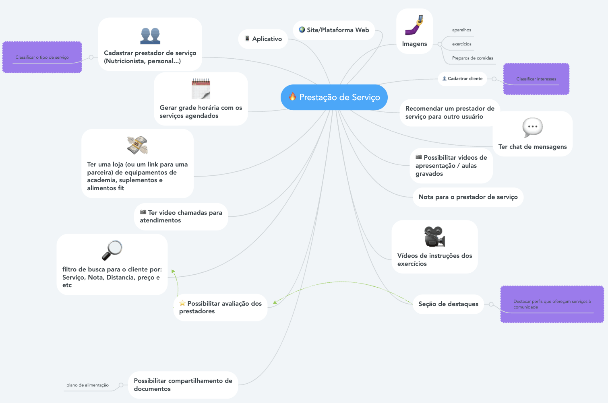

<figcaption>Imagem: Escopo da Solução</figcaption>
<figcaption>Autor:  Equipe</figcaption>

### 1.3. Tabela de artefatos gerados

A seguir, foram mapeados os artefatos gerados durante as fases inicias do projeto, das quais serão relacionados nos tópicos arquiteturais sequentemente.

| Base                          |        Modelagem         |
| :---------------------------- | :----------------------: |
| Design Sprint                 |   Diagrama de classes    |
| Brainstorm                    |   Diagrama de pacotes    |
| Diagrama de Causa e Efeito    | Diagrama de componentes  |
| Rich Picture                  | Diagrama de implantação  |
| 5W2H                          |  Diagrama de sequência   |
| Léxicos                       | Diagrama de comunicação  |
| Introspecção                  |   Diagrama de estados    |
| FURPS+                        |  Diagrama de atividades  |
| Questionário                  |         Backlog          |
| MoSCoW                        | Documento de tecnologias |
| Plano de Gerencia de Riscos   |           EAP            |
| Protótipo de Media Fidelidade |       Diagrama NFR       |
| BPMN                          |          CANVAS          |
| Documento de Metodologia      |       Casos de Uso       |
| TAP                           |      Guia de Estilo      |
| Política de contribuição      |            -             |
| Heatmap                       |            -             |

## 2. Representação Arquitetural

### 2.1. Front-end

 O <b>React Native</b> foi a escolha do framework a ser utilizado no front-end principalmente porque possibilita a criação de aplicações em multiplataformas, tanto no Android quanto no iOS. Além disso, o React Native possui ferramentas que convertem o código para a linguagem nativa do sistema operacional utilizado, tornando o app mais fluido. Uma outra facilidade é quando se tange às aplicações híbridas, em que o React Native cria uma arquitetura através da bridge. A Bridge é a responsável pela comunicação entre o código JS e o código nativo.

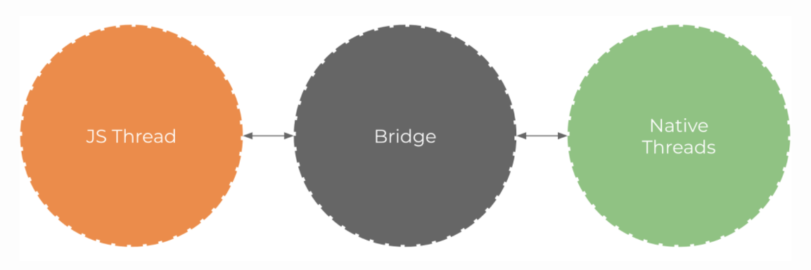

<figcaption>Imagem: Arquitetura React Native</figcaption>
<figcaption>Autor: Undefined</figcaption>

### 2.2. Back-end

 A base do nosso back-end se dá pelo <b>Node.js</b> que é um ambiente de execução Javascript server-side, ou seja, pode-se criar aplicações javascript sem a necessidade de um browser, tendo como principal característica sua alta escalabilidade. Outro ponto é que sua arquitetura possibilita um número considerável de requisições concorrentes quando comparadas ao modelo tradicional.

 O <b>Express.js</b> também foi utilizado porque é um framework de aplicação para o Node.js, que serve como um software de código aberto, multiplataforma, baseado no interpretador V8 do Google e que permite a execução de códigos JavaScript fora de um navegador web. O Express fornece uma fina camada de recursos fundamentais de aplicativos web, sem ocultar recursos node.js.

 Cabe também citar o <b>Sequelize</b> que é um ORM baseado para alguns bancos de dados, entre eles, o Postrgres (banco utilizado no projeto). Ele contribui no suporte de transações e no gerenciamento de dados, utilizando métodos JS, facilitando na modificação das estruturas de dados, como também na criação, população e outras tarefas.

 Já o <b>Docker</b> também foi utilizado, sendo uma plataforma open source que facilita a integração em ambientes isolados. Em resumo, ele "empacota" uma aplicação dentro de containers, bastando que a outra pessoa tenha o Docker instalado para poder rodar a aplicação desejada.

Ademais, o back-end poderá ser melhor compreendido no tópico de Visão Lógica desse mesmo documento. 

### 2.3. Banco de Dados

O <b>PostgreSQL</b> foi o banco escolhido para armazenar os dados da nossa aplicação devido a sua semelhança com o MySQL, sendo altamente escalável e de fácil integração.

No tópico de Visão de Dados, será abordado de forma mais aprofundada.

<!-- Fim Gustave -->

<!-- Fernando -->

## 3. Metas e Restrições da arquitetura

### 3.1. Metas

 As metas da nossa arquitetura foram definidas a partir da pesquisa inicial, de acordo com as necessidades observadas durante o processo de levantamento de requisitos. Algumas das nossas principais metas estabelecidas foram:

 
#### 3.1.1. Portabilidade:
a plataforma deve estar disponível em ambientes mobile, bem como web e desktop

#### 3.1.2. Usabilidade:

é essencial que o sistema possibilite o usuário a realizar as ações rapidamente, intuitivamente, com qualidade e satisfação para que tenhamos cada vez mais o alcançe e aceitação do público.

#### 3.1.3. Responsividade:

devido à variedade de dispositivos que temos atualmente, é importante que a plataforma renderize bem em qualquer um dos tamanhos de tela utilizados para o acesso.

#### 3.1.4. Escalabilidade

A aplicação deve ser estruturada com o objetivo de ser escalável o suficiente para ser possível futuras evoluções com o crescimento do projeto.

#### 3.1.5. Segurança

O aplicativo deve ser seguro e lidar com os dados dos usuários com segurança, de forma que a informação só pode ser acessada e atualizada por pessoas autorizadas e devidamente credenciadas (autenticação de usuários).

#### 3.1.6. Usabilidade

O sistema deverá ter a capacidade em fazer com que o usuário tenha sucesso na execução de suas tarefas de maneira simples.

### 3.2. Restrições

| Restrições    | Descrição                                                                                                      |
| :------------ | :------------------------------------------------------------------------------------------------------------- |
| Plataforma    | A aplicação terá suporte nativo para dispositivos mobile e browsers                                            |
| Linguagem     | A aplicação será desenvolvida em idioma português do Brasil.                                                   |
| Público       | A aplicação será voltada para prestadores de diversos serviços da saúde e fitness e seus respectivos clientes. |
| Equipe        | A equipe de desenvolvimento possui 10 alunos integrantes do curso de Eng. de Software da UnB.                  |
| Conectividade | É necessária a conectividade com a internet para o acesso e utilização da aplicação.                           |

<!-- Fim Fernando -->

<!-- Daniel -->

## 4. Visão de casos de uso

### 4.1. Visão de Casos de Uso

&emsp;&emsp;Apresentando uma representação mais próxima do cliente ou profissional, a visão de casos de uso auxilia no entendimento das interações dos atores com o sistema de forma a descrever os cenários de uso da aplicação. O diagrama de casos de uso do projeto Ser Fit pode ser acessado pelo [documento de casos de uso](../../Modelagem/IniciativasExtras/CasosdeUso) desenvolvido anteriormente. 
&emsp;&emsp;A seguir, tem-se uma descrição resumida dos casos de uso o projeto, os quais contemplam as funcionalidades mais prioritárias do sistema.

#### Descrição dos casos de uso

- **UC01 - Registrar-se:** este caso de uso engloba tanto o cliente quanto o personal. Consiste no ato do usuário (cliente ou personal) se registrar no aplicativo, para isso é necessário informar senha, email e nome. Apos realizado o registro uma série de serviços do aplicativo se tornarão disponíveis para uso.

- **UC02 - Pesquisar Profissionais:** este caso de uso é exclusivo do ator cliente. Se trata do ato de após realizado o registro o cliente acessar o aplicativo, fazer o login e pesquisar profissionais disponíveis e ver detalhes, a pós-condição desse caso seria de contratar um profissional.

- **UC03 - Conversar com Cliente:** este caso de uso é exclusivo do ator profissional. Se trata do ato de após realizado o registro o profissional acessar o aplicativo, fazer o login e entrar no chat, a pós-condição desse caso seria de conversar com um cliente.

<!-- Fim Daniel -->

<!-- Ricardo -->

## 5. Visão Lógica

 A visão lógica representa como a organização conceitual do sistema vai ser estruturado de maneira lógica. Para isso, fazemos o uso de artefatos que demonstrem a estrutura, como os diagramas de classes, de pacote, de colaboração, de interação e até mesmo de sequência do caso.

Dependendo da complexidade do sistema, ou da necessidade de explicar as especificidades, podemos usar vários desses documentos, temos como objetivo esses documentos serem suficientes para a compreensão do sistema para quem estiver lendo.

### 5.1. Diagrama de classes

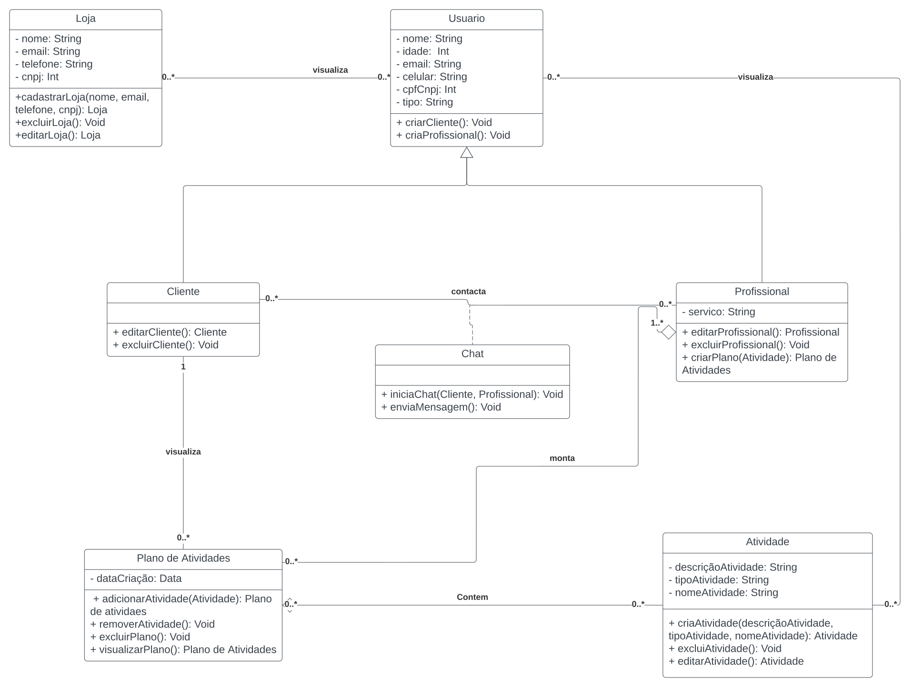

<figcaption>Imagem: Diagrama de Classes.</figcaption>
<figcaption>Autor: Ricardo Loureiro</figcaption>

### 5.2. Diagrama de pacotes

O diagrama de pacotes é usado para representar a visão lógica da arquitetura do nosso projeto Ser-Fit, ele aborda as camadas e pacotes utilizados no sistema.
Nosso projeto tem duas frentes de implementação e detalharemos cada um em sequência.

#### **Front-End**

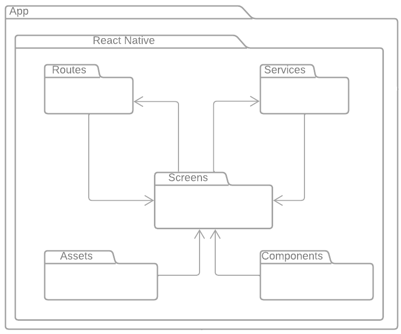
<figcaption>Imagem: Diagrama de Pacotes - Front End</figcaption>
<figcaption>Autor: Gustave Persjn</figcaption>

 

O nosso front-end é que contém o nosso view, ela que é responsável pela interação com o usuário. O ponto inicial é a pagina <strong>Rountes</strong>, é onde tem as chamadas para o conteúdo da aplicação, esses conteúdos da página Routes é oriundo tanto das páginas <strong>Screens</strong> e <strong>Components</strong>.

Também pode ser oriundo da página <strong>Assets</strong>, que tem a função armazenamento de média estática. Por fim temos as pastas <strong>Services</strong> e <strong>MicroServices</strong> que são responsáveis pela comunicação API do sistema com o Back End.

#### **Back-End**

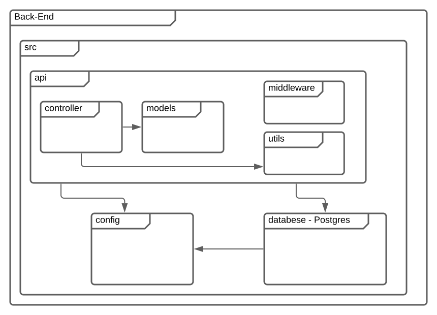
<figcaption>Imagem: Diagrama de Pacotes - Back End</figcaption>
<figcaption>Autor: Ricardo Loureiro</figcaption>

 

No banck-end temos a camada de <strong>controller</strong> que é onde os recebem requisições de componentes externos. Ele filtra as solicitações de requisições que são enviadas pelo front-end.

<strong>Controller</strong> e <strong>Model</strong> estão representados no diagrama de pacotes que estão no diretório do API.

Ainda em API, temos os <strong>middlewares</strong> e <strong>utils</strong> que contém as classes que auxiliam na camada de controle na aplicação e nos padrões de projeto.

Diretamente temos a pasta <strong>config</strong>, no qual estão as definições e variáveis de ambientes e autenticação. O banco de dados no diretório <strong>database</strong>, que contém as regras para modificação das tabelas.

### 5.3. Diagrama de comunicação

O diagrama de comunicação é definido para esclarecer funções de objetos e classes, esse diagrama mostra as interações entre objetos e/ou partes. Assim esse diagrama pode ser utilizado para complementar a representação da visão lógica da arquitetura do processo, pois ele foi feito para abordar uma visão mais macro do sistema com foco na lógica da aplicação.

#### **Fluxo Cliente**

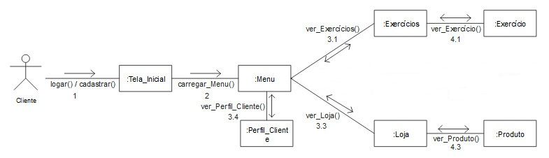
<figcaption>Imagem: Diagrama de Comunicação - Cliente</figcaption>
<figcaption>Autor: Ricardo Loureiro</figcaption>

 

#### **Fluxo Personal**

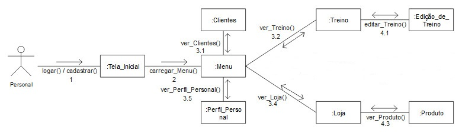
<figcaption>Imagem: Diagrama de Comunicação - Personal</figcaption>
<figcaption>Autor: Ricardo Loureiro</figcaption>

 

Nosso diagrama de comunicação é definido em fluxo do cliente e fluxo do personal e pode ser visto nesta <a href = "https://unbarqdsw2022-1.github.io/2022_1_G5_SerFit/#/Modelagem/DiagramasDinamicos/DiagramaDeComunicacao">página</a>

<!-- Lucas e Victor -->

## 6. Visão de processos

### 6.1. Diagrama de atividades

Levando em conta a notação UML (Unified Modeling Language, ou, em português, Linguagem de Modelagem Unificada) o *Diagrama de Atividades* é considerado um diagrama de comportamento que está descrevendo o que é necessário acontecer no sistema durante o processo de modelagem do aplciativo **SerFit**.
Este diagrama fornece uma visualização do comportamento de um sistema descrevendo a sequência de ações em um processo, como mostrado nos diagramas abaixo.

#### Cadastro

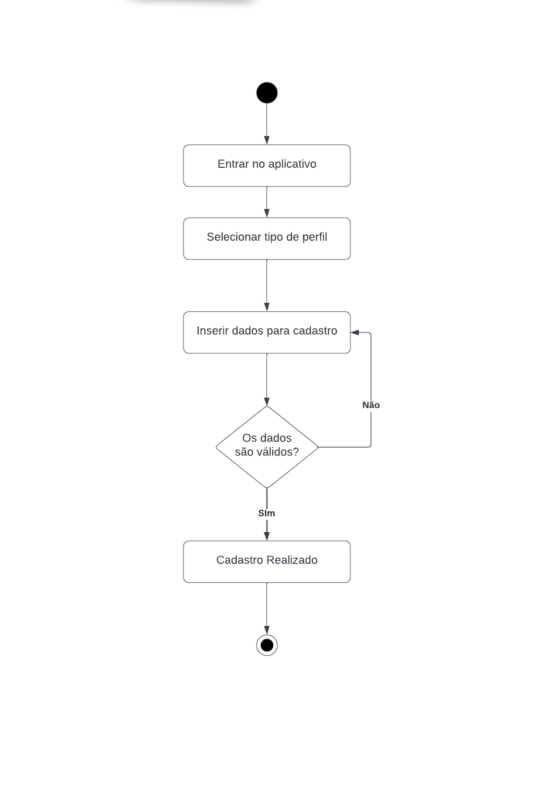

<figcaption>Imagem: Diagrama de Atividades - Cadastro</figcaption>
<figcaption>Autor: Lucas Gomes e Victor Hugo</figcaption>

#### Profissional

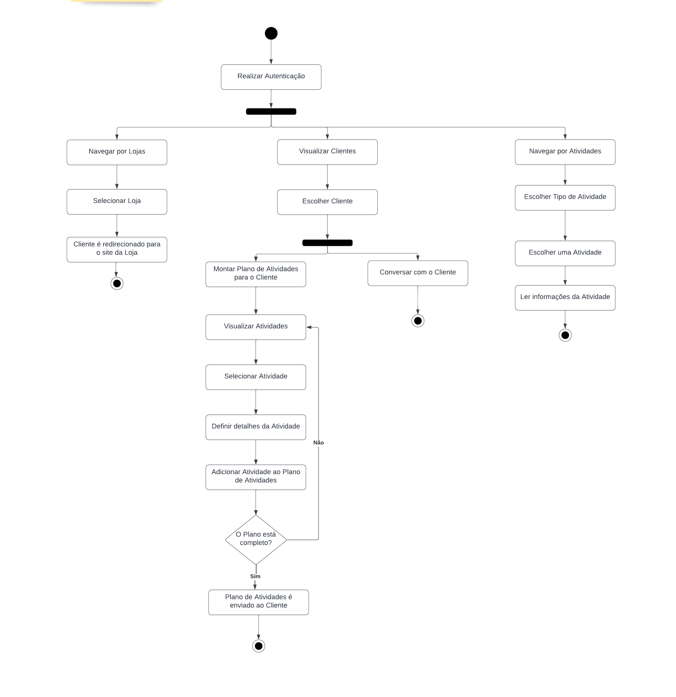

<figcaption>Imagem: Diagrama de Atividades - Profissional</figcaption>
<figcaption>Autor: Lucas Gomes e Victor Hugo</figcaption>

#### Cliente

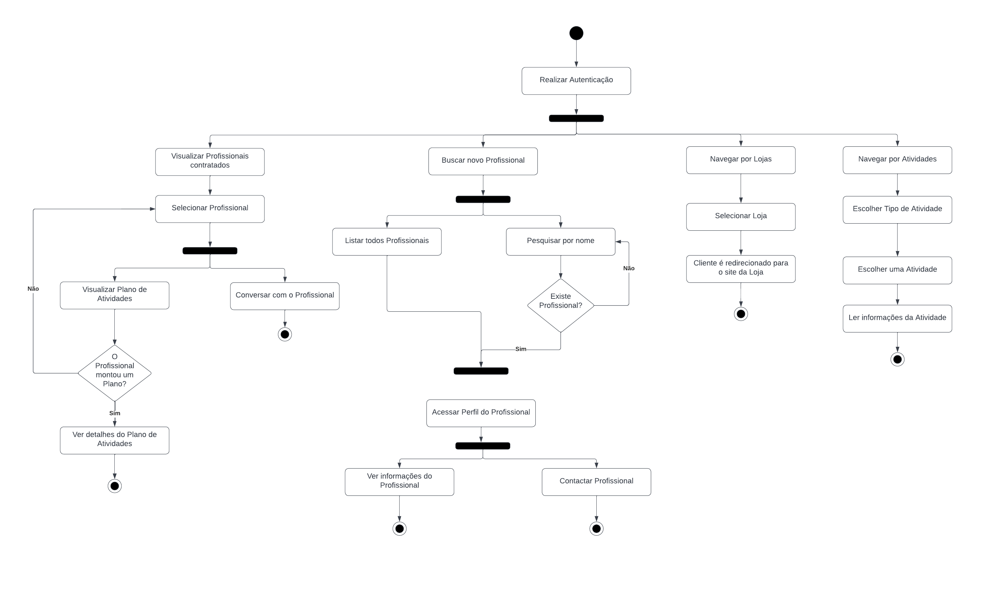

<figcaption>Imagem: Diagrama de Atividades - Cliente</figcaption>
<figcaption>Autor: Lucas Gomes e Victor Hugo</figcaption>

### 6.2. Diagrama de sequência

Também seguindo a notação UML o *Diagrama de Sequência* é um modelo que mostra o comportamento dinâmico da aplicativo **SerFit** através de duas dimensões: Mudanças de estado interna, através da descrição de como um objeto altera o seu estado, e as Interações, que são descritas pelo comportamento externo e a sua dinâmica com outros objetos. Levando em consideração os dois tipos de usuário (Cliente e Personal), o aplicativo e o banco de dados, o comportamento dinâmico é estabalecido seguindo o diagrama abaixo.

  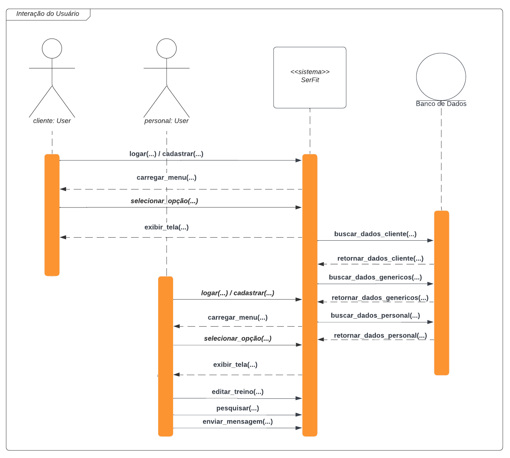

<figcaption>Imagem: Diagrama de Sequência</figcaption>
<figcaption>Autor: Lucas Gomes e Victor Hugo</figcaption>

<!-- Fim Lucas e Victor -->

<!-- Luis -->

## 7. Visão de implantação

 Para fornecer uma base que permitirá compreender a distribuição física do sistema em um conjunto de nós de processamento, uma visualização arquitetural chamada visualização de implementação é utilizada no fluxo de trabalho. A visão de implantação ilustra a distribuição do processamento em um conjunto de nós do sistema, incluindo a distribuição física dos processos e threads. Ela é refinada durante cada iteração.

### 7.1. Diagrama de componentes

O Diagrama de Componentes fornece uma visão geral de um sistema de software, mostrando o relacionamento entre os diferentes componentes deste sistema. Este diagrama geralmente é desenvolvido para ajudar a modelar os detalhes da implementação e para verificar novamente se todos os aspectos dos requisitos do sistema estão sendo cobertos pelo desenvolvimento planejado. 

O Diagrama de componentes é formado pelos símbolos abordados no documento do [diagrama de componentes](../../Modelagem/DiagramasEstaticos/DiagramaDeComponentes.md).

<figcaption>Imagem: Diagrama de Componentes</figcaption>
<figcaption>Autor: Luis Gustavo</figcaption>

### 7.2. Diagrama de implantação

 Ser_Fit é uma aplicação mobile que segue o modelo de camadas, em que existe as camadas: frontend (representada pelo aplicativo feito com ReactJS), backend (representado pelo servidor NodeJS) e a base da dados (representado pelo banco PostgreSQL). O diagrama de implementação possui representações dessas camadas juntamente com a camada de interface do cliente que tem acesso apenas a interface do frontend. O usuário acessa por meio de um aplicativo nativo e o frontend realiza requisições ao backend, que por sua vez realiza os serviços solicitados, armazenando e buscando os dados necessários na base de dados.

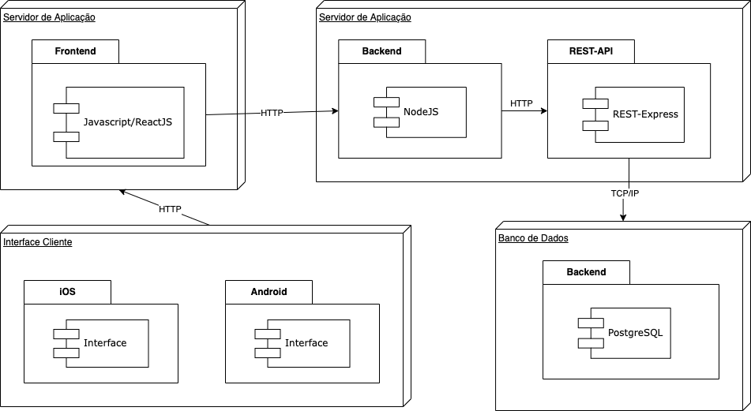

<figcaption>Imagem: Diagrama de Implantação</figcaption>
<figcaption>Autor: Luis Gustavo</figcaption>

<!-- Fim Luis -->

<!-- Felipe -->

## 8. Visão de dados

Se por um lado a visão lógica descreve como o sistema é estruturado, a visão de dados vem com o objetivo de ser uma especialização dessa visão lógica. A ideia principal é que essa visão seja utilizada se a persistência for um aspecto realmente significativo do sistema e se a conversão do modelo de design — para o modelo de dados não for feita automaticamente pelos mecanimos de persistência.

Existem  diversas visões, mas nem todas são relevantes para todos os projetos, e a visão de dados muitas vezes é considerada como opcional.

Tratamos dessa visão quando o sistema tem camadas de persistência, visto que também ela contém um detalhamento do banco de dados. Um modelo que podemos utilizar como referência nessa visão de dados, é justamente o DER, o diagrama de Entidade-Relacionamento, que aborda uma forma de representar graficamente a modelagem do banco de dados. A figura abaixo representa o DER Conceitual.

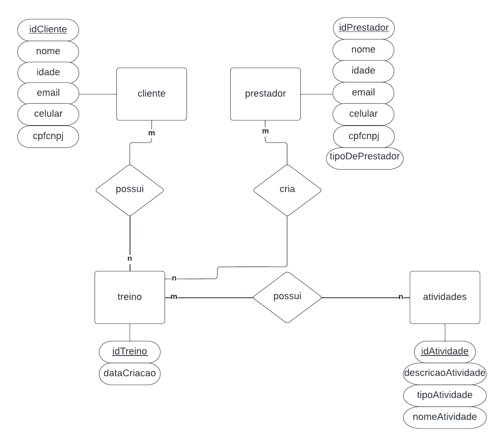

<figcaption>Imagem: Diagrama de Banco de Dados</figcaption>
<figcaption>Autor: Felipe Correia</figcaption>

<!-- Fim Felipe -->

<!-- Wesley -->

## 9. Tamanho e desempenho

    Levando em consideração os repositórios da aplicação SerFit ainda em desenvolvimento e evolução, concluímos  que o somatório não passará de 1GB. Para acessar a aplicação, não é necessário a instalação de nenhum programa, apenas acesso a internet e um dispositivo mobile ou computador. Além disso, a aplicação deve suportar muitas conexões simultâneas, por se tratar de uma plataforma que deve ser usada diariamente por um grupo de pessoas.

## 10. Qualidade de Software

 Na etapa de construção da aplicação utilizamos o padrão de arquitetura MVC, sendo possível fazer a divisão em camadas e subcamadas bem definidas, possibilitando a compreensão do código, além da sua reutilização. Foi utilizada também a norma ISO/IEC 9126, cujo objetivo é definir um conjunto de parâmetros que visam padronizar a avaliação da qualidade de software.

| Critérios        | Descrição                                                                                                                                                                                                                                                               |
| ---------------- | ----------------------------------------------------------------------------------------------------------------------------------------------------------------------------------------------------------------------------------------------------------------------- |
| Funcionalidade   | A aplicação foi construída segundo os requisitos que foram levantados na fase inicial do projeto.                                                                                                                                                                       |
| Confiabilidade   | O sistema foi desenvolvido para garantir que o mesmo se recupere em caso de falhas                                                                                                                                                                                      |
| Usabilidade      | O sistema possui uma interface simples, clara, intuitiva e foi construída com base no protótipo de alta fidelidade. Também é possível notar que o sistema utiliza linguagem clara e direta, simplificando o entendimento do que está sendo feito e o que se pode fazer. |
| Eficiência       | O sistema é otimizado em relação ao tempo de resposta de requisições.                                                                                                                                                                                                   |
| Manutenibilidade | Os padrões de projeto aplicados durante o desenvolvimento facilitam a identificação de defeitos, na correção e evolução do código. Além da documentação estar disponível no repositório do grupo, facilitando a consulta e apoiando na manutenibilidade do código.      |
| Portabilidade    | A utilização do Docker garante um ambiente estável, o que auxilia na criação de possíveis novos módulos.                                                                                                                                                                |

<!-- Fim Wesley -->

## Referências Bibliográficas

> Conceito: Visão de Implementação. Disponível em < https://www.cin.ufpe.br/~gta/rup-vc/core.base_rup/guidances/concepts/deployment_view_64CB74A6.html > Acesso 07 de Setembro de 2022.
> O que é diagrama de componentes UML?. Disponível em https://www.lucidchart.com/pages/pt/diagrama-de-componentes-uml. Acesso em: 07 de Setembro de 2022.
> Component Diagram. Disponível em: https://www.smartdraw.com/component-diagram/#:~:text=A%20component%20diagram%2C%20also%20known,is%20covered%20by%20planned%20development. Acesso 07 de Setembro de 2022.
> Visões Arquiteturais. Disponível em https://www.inf.ufpr.br/andrey/ci163/VisoesAl.pdf.
> SERRANO,Milene; SERRANO, Maurício; CAVALCANTE, André Cruz. Arquitetura de Software deReferência para Sistemas de Informação Governamentais. In: XI Brazilian Symposium on Information System, Goiânia, Maio 26-29, 2015. Disponível em: https://sol.sbc.org.br/index.php/sbsi/article/view/5886/5784
> \*Demais referências disponíveis no documento de cada artefato elaborado e disponível na Wiki

# Histórico de Versionamento

| Versão | Alteração                                                        |   Autor(es)    | Revisor(es) |
| :----: | :--------------------------------------------------------------- | :------------: | :---------: |
|  1.0   | Criação do template                                              |    Gustave     |      -      |
|  1.1   | Criação do tópico Visão Lógica                                   |    Ricardo     |      -      |
|  1.2   | Criação do tópico Diagrama de Implantação                        |      Luis      |      -      |
|  1.3   | Criação do tópico de Desempenho, Tamanho e Qualidade do Software |     Wesley     |      -      |
|  1.4   | Criação do tópico Introdução e Representação Arquitetural        |    Gustave     |      -      |
|  1.5   | Criação do tópico Metas e Restrições da Arquitetura              |    Fernando    |      -      |
|  1.6   | Criação do tópico Visão de Casos de Uso                          |     Daniel     |      -      |
|  1.7   | Criação do tópico Visão de Processos                             | Lucas e Victor |      -      |
|  1.8   | Criação do tópico Visão de Dados                                 |     Felipe     |      -      |
