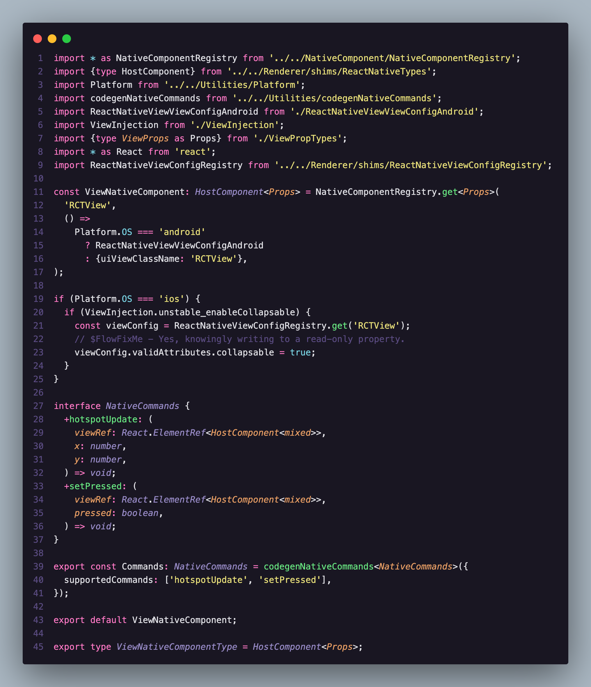
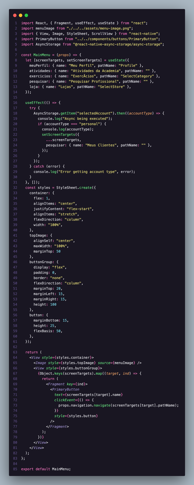
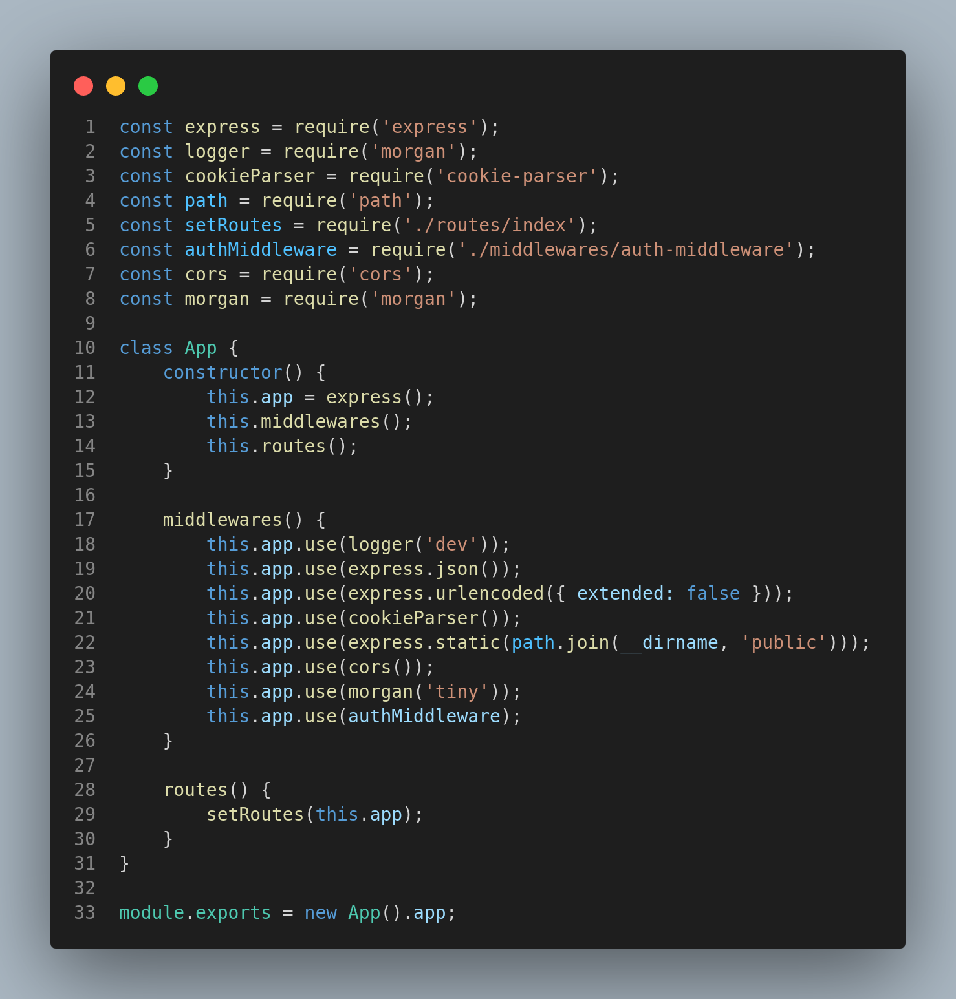
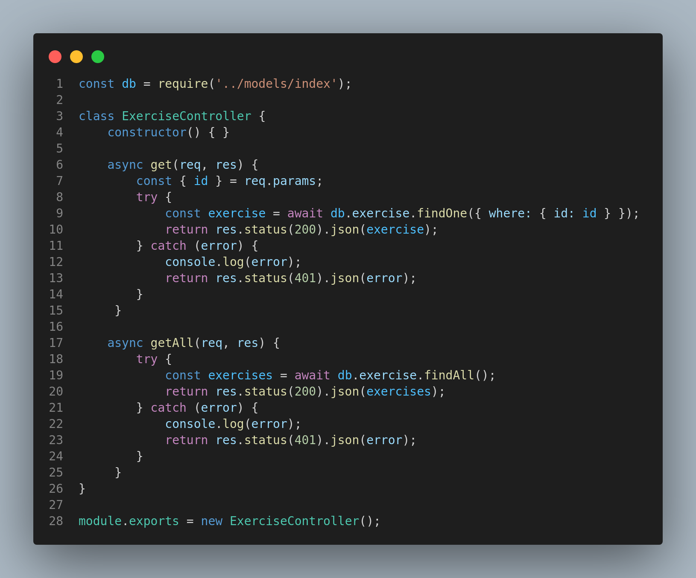
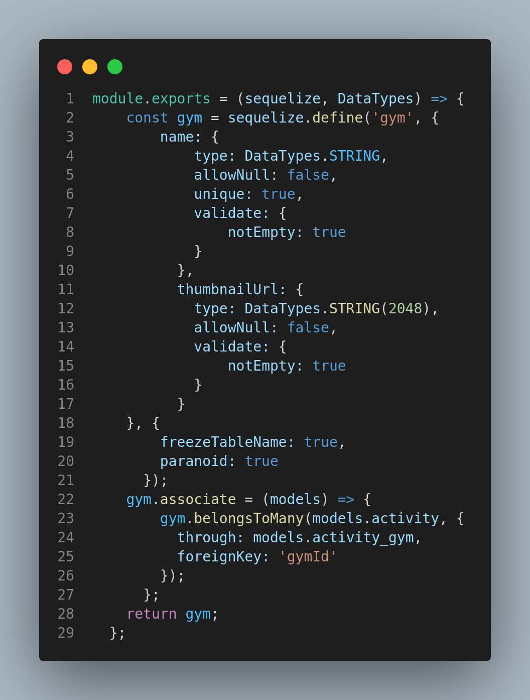
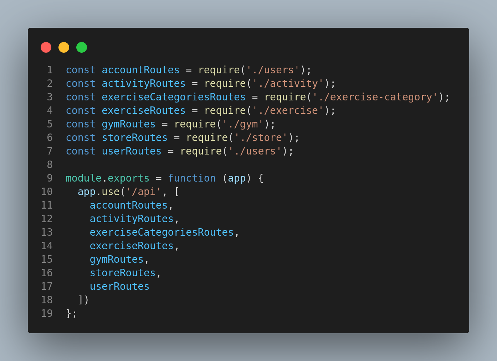

# Documento de Reutilização

## 1. Introdução

Esse documento tem como principal objetivo documentar as partes do projeto SerFit que utilizam a reutilização de código. Além da reutilização aplicável a nível de projeto (utilizando boas práticas e padrões de projeto já bem estabelecidos, testados e comuns a diversos projetos) pode-se ter em foco a reutilização a nível de código e de componentes e bibliotecas. Evidenciamos uma visão para a reutilização do Front-end e Back-end. 

## 2. Metodologia

Através de uma análise das tecnologias utilizadas e de suas documentações e código, e dos conceitos aprendidos nas aulas e da disciplina de Arquitetura e Desenho de Software, propôs-se uma descrição das características de reutilização do Front-end e do Back-end, como bibliotecas e frameworks. 

## 3. Reutilização do Front End

### 3.1. Tecnologias, frameworks e bibliotecas

A tecnologia utilizada para compor o front-end (Aplicativo) do projeto SerFit, foi o React-Native. Segundo o próprio projeto, open-source, mantido pela empresa Facebook, o React native é "Um framework para construir aplicações nativas utilizando React". Percebe-se que, assim como outros frameworks, como o Flutter, o React-Native pretende ser um framework cross-platform, isto é, funcionar em diferentes ambientes. 

No caso do React-Native, serve tanto para desenvolvimento para aparelhos que utilizam sistema IOS quanto para o sistema Android e plataformas web, bastando algumas alterações de compatibilidade e na hora de se evidenciar o build. Com isso já se é possível ver o favorecimento da reutilização do software desenvolvido, servindo para diversas plataformas, com poucas modificações do código. Mas primeiramente podemos verificar como o React Native se encaixa na definição de framework.

Como exposto na aula de REUTILIZAÇÃO & FRAMEWORK uma das definições de framework, descritas por Fayad et al (1999), é de que "um framework é um conjunto de classes que constitui um projeto para a solução de uma família de problemas". Isso pode ser percebido no código do projeto React-native, que mesmo com a estrutura permissiva da linguagem javascript, utiliza a sintaxe do typescript para o controle de Interfaces e estruturas abstratas (Figura 1).

<figcaption>Figura 1: Amostra do código.</figcaption>

### 3.2. Análise de tipo

A utilização mais comum do react-native é como um framework de caixa-preta, ou seja, sua reutilização se dá por composição de componentes já construídos, utilizando-se dos atibutos das instâncias para customização e configuração. Na Figura 2, no código a seguir, do projeto Ser Fit, segue um exemplo disso. O código pode ser acessado no repositórios, [clicando aqui](https://github.com/UnBArqDsw2022-1/2022.1_G5_SerFit_App/blob/main/app/views/MainMenu/index.jsx)

<figcaption>Figura 2: Amostra do código.</figcaption>

 

Pelo código, é possível verificar a importação de componentes do framework. Como View, Image e StyleSheet. Esse componentes são instaciados e configurados no retorno da função, para serem renderizados.

Uma fonte de HotSpots do React-Native são seus métodos hooks para objetos funcionais que permitem a modificação e inserção de métodos dentro do ciclo de vida desses componentes, sem ter que criar uma classe para isso, permitindo a customização desses métodos de templates que são implementados em todos os componetes React. Isso pode ser visualizado no código disponibilizado acima, com a utilização do hook useState que insere um método (set) à ser executado e uma variável que para ser modificada, sem que seja necessário renderizar toda a página.

## 4. Reutilização do Back End

### 4.1. Tecnologias, frameworks e bibliotecas

 A base do nosso back-end se dá pelo <b>Node.js</b> e pelo <b>Express.js</b>. Em termos de desenvolvedor, o próprio Node.js tornou possível compartilhar e reutilizar código. Com a ajuda de módulos Node, os desenvolvedores podem usar módulos pré-construídos ou adaptar os seus próprios.

Pode-se observar na imagem acima um exemplo no backend da aplicação em que mostra o uso de alguns desses módulos, como também a criação/adaptação de alguns módulos utilizados para o controle, como o Middleware. 

### 4.2. Hots-pots e Frozen-spots

Hots-pots são partes de um framework onde uma adaptação pode ser feita. Uns exemplos são classes abstratas, métodos abstratos, métodos hook e outros. A contexto da nossa aplicação, podemos apresentar o sequelize que pode utilizar a mesma API para qualquer banco de dados, podendo ser uma parte reutilizada para as todas requisções do projeto, encontradas no Controller da aplicação, conforme exemplo da imagem abaixo:

Outro exemplo seria o próprio sequelize para a criação dos models, ao todo, o módulo foi utilizado para a criação de 8 modelos, sendo reaproveitado em todas elas.

Já os frozen-spots são partes de um framework que não foi projetada para uma adaptação. Como exemplos têm-se as classes concretas, métodos template, etc. A contexto do nosso projeto, têm-se as rotas, dentro de routes, onde tem uma entrada esperada e uma saída esperada:

## 5. Conclusão

Para o aplicativo Ser Fit, que funciona como o Front-end do projeto, o React-Native, por ser um Framework extremamente robusto e que permite a criação dos nossos próprios componentes através da configuração de componentes genéricos, facilita grandemente a reutilização de software do projeto, contribuindo para sua manutenibilidade e escalabilidade, por conseguinte. Com alguns controles (como o objeto Platform.os que permite verificar em qual ambiente a aplicação está sendo rodada) e utilizando o mesmo projeto, Ele permite o desenvolvimento de um único código para as plataformas mais utilizadas no mercado (Web, Android e IOS) ou seja, o conceito eficiente de reutilização.

## Referências

> SERRANO, Milene. Arquitetura e Desenho de Software - Aula REUTILIZAÇÃO & FRAMEWORK 1º/2022. Material apresentado para a disciplina de Arquitetura e Desenho de Software no curso de Engenharia de Software da UnB, FGA.
> https://reactnative.dev > https://github.com/facebook/react-native
> VERGILIO, Silva. Padrões Arquiteturais. Disponível em: https://www.google.com/url?sa=t&rct=j&q=&esrc=s&source=web&cd=&ved=2ahUKEwjEkciDvIX6AhXXrpUCHZcmB7kQFnoECAgQAQ&url=https%3A%2F%2Fwww.inf.ufpr.br%2Fandrey%2Fci163%2FPadroesFrameworksAl.pdf&usg=AOvVaw2nCtwyri-MjTiQZhY53qcS

## Histórico de Versionamento

| Versão | Alteração                | Autor(es)       | Revisor(es) |
| ------ | ------------------------ | --------------- | ----------- |
| 1.0    | Criação do documento     | Adrian Soares   | ---         |
| 1.1    | Reutilização do back-end | Gustave Persijn | ---         |
