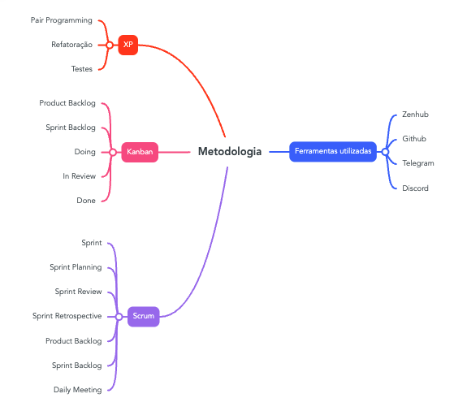

# Metodologia

## 1. Introdução

Este documento tem como finalidade descrever e explicar as abordagens, metodologias, processos e ferramentas de apoio as metodologias utilizadas no projeto. Estão descritas as metodologias referenciadas para definição do processe juntamente com os artefatos selecionados destas.

## 2. Metodologias

### 2.1 Scrum

O Scrum é um framework que ajuda pessoas, equipes e organizações a gerar valor por meio de soluções adaptáveis ​​para problemas complexos. Esta metodologia parte da premissa que o desenvolvimento de software é muito complexo e imprevisível para ser completamente planejado com antecedência, assim esta metodologia é baseada em processos iterativos e incrementais. A iteração é conhecida por sprint, que consiste em um período de tempo, que costuma variar entre 1 e 4 semanas, ao final de cada sprint é entregue uma parte do produto final a ser desenvolvido.

Esta metodologia contém diversas cerimônias, práticas, atividades e artefatos. Dentre estes, para melhor adaptação ao projeto, foram selecionados:

- **Sprint:** Pequeno ciclo iterativo com duração de uma semana;
- **Sprint Planning:** Reunião que acontece ao início de cada sprint, com o objetivo de definir, principalmente, as tarefas a serem realizadas durante a sprint e os pareamentos que ficarão reponsáveis por cada tarefa;
- **Sprint Review e Sprint Retrospective:** Ocorrerão ao final de cada sprint, é um momento para avaliar tudo o que foi desenvolvido durante a sprint e, além disso, entender o que ocorreu de forma boa e também o que pode ser melhorado para a próxima sprint;
- **Product Backlog:** Todas as funcionalidades que se deseja realizar ao longo do projeto;
- **Sprint Backlog:** Tarefas que devem ser realizadas na sprint atual;
- **Daily Meeting:** Reunião diária que ocorre durante a sprint com o intuito de alinhar todo o time em relação ao que se está sendo feito e para remover eventuais impedimentos.

### 2.2 XP

O XP (<i>Extreme Programming</i>) é uma framework de desenvolvimento de software ágil que visa produzir software de maior qualidade e maior qualidade de vida para a equipe de desenvolvimento. XP é o mais específico dos frameworks ágeis em relação às práticas de engenharia apropriadas para o desenvolvimento de software.

O XP possui cinco valores, sendo estes comunicação, simplicidade, feedback, coragem e respeito, e um conjunto interconectado de práticas de desenvolvimento de software. Para este projeto serão adotadas três práticas importantes do XP, que são:

- **Testes:** Todo código escrito deve ser devidamente testado para ser validado com os requisitos e para ser definido como pronto;
- **Refatoração:** Uma prática excelente para manter o design simples, e um dos usos mais recomendados da refatoração é remover a duplicação de processos.
- **Pair Programming:** Significa que todo o software de produção é desenvolvido por duas pessoas "sentadas na mesma máquina". Obtém-se efetivamente uma revisão de código contínua e uma resposta mais rápida a problemas difíceis que podem parar uma pessoa em seu caminho.

### 2.3 Kanban

Kanban é uma palavra da língua japonesa que significa "cartão de sinal" e uma de suas características é evidenciar problemas existentes no processo. Este método surgiu no Japão com o sistema de produção da Toyota que procurava controlar a fabricação de automóveis de forma coerente com a demanda que definia o ritmo de produção. Assim, a indústria adaptava sua velocidade de produção de acordo com o nível de consumo dos clientes.

As principais características do Kanban são:

- Visualização do fluxo de trabalho;
- Limitação do fluxo trabalho;
- Gerenciamento e acompanhamento do fluxo de trabalho.

Para fornecer a percepção visual de continuidade do fluxo de trabalho, o método Kanban utiliza o quadro que leva seu nome. Trata-se de uma ferramenta que as equipes usam para visualizar seu fluxo de trabalho. Normalmente, o quadro kanban é elaborado com três colunas que indicam a situação das ações planejadas: **por fazer (_To Do_)**, **em processo (_Doing_)** e **feito (_Done_)**.

Neste contexto será utilizado do quadro Kanban com as seguintes pipelines:

Para nosso contexto serão utilizados as seguintes pipelines:

- **Product Backlog:** Todas as funcionalidades que se deseja realizar ao longo do projeto
- **Sprint Backlog:** Tarefas que devem ser realizadas na sprint atual;
- **In Progress:** Tarefas em andamento;
- **In Review:** Tarefa aguardando revisão;
- **Done:** Tarefa finalizada.

## 3. Referências

- Scrum Guide. Disponível em: < <https://scrumguides.org/scrum-guide.html> > Acesso em: 22 de Junho de 2022
- GENARI, J. O. S.; FERRARI, F. C. Times de alto desempenho no contexto dasmetodologias scrum e kanban. p. 9, 2015.
- SILVA, D. V. d. S.; SANTOS, F. A. d. O.; NETO, P. S. Os benefícios do uso de kanban na gerência de projetos de manutenção de software. In: . [S.l.]: VIII Simpósio Brasileiro de Sistemas de Informação, 2012.
- What is Extreme Programming. Disponível em: < <https://www.agilealliance.org/glossary/xp/>) > Acesso em: 22 de Junho de 2022
- SOMMERVILLE, I. Engenharia de software. [S.l.]: Pearson Prentice Hall, 2011. ISBN 978-85-7936-108-1.

## Histórico de Versionamento

| Versão | Alteração                                                                | Autor(es)    | Revisor(es) |
| ------ | ------------------------------------------------------------------------ | ------------ | ----------- |
| 1.0    | Criação do mapa mental das metodologias                                  | Luis Gustavo | ---         |
| 1.1    | Descrição de cada metodologia escolhida, juntamente com suas referências | Luis Gustavo | ---         |
| 1.2    | Revisão ortográfica e de formatação da v1.0 e v1.1                       | Gustave      | ---         |
