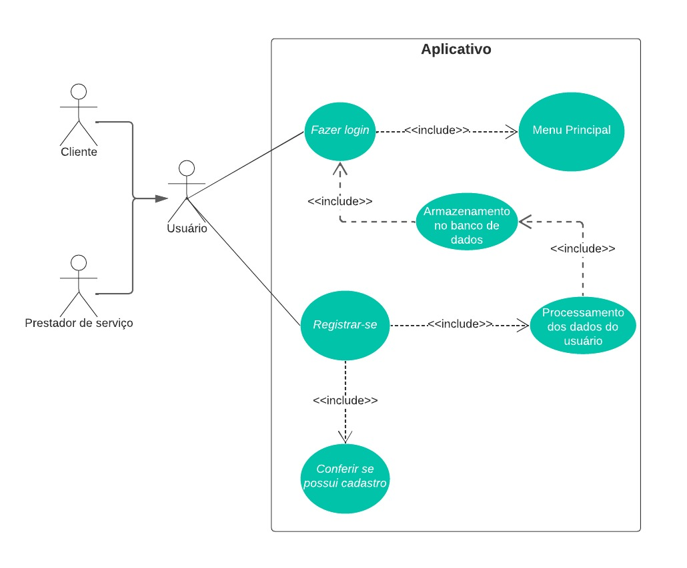
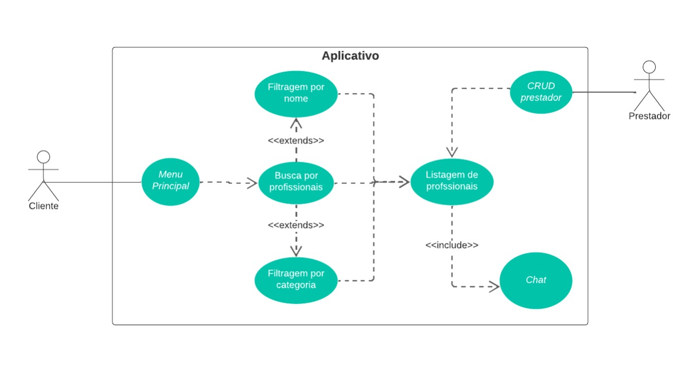
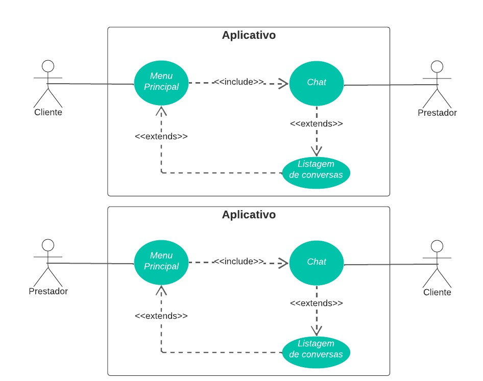

# Casos de Uso

## 1. Introdução

Um caso de uso é um classificador comportamental que especifica uma unidade de funcionalidade executada por um ou mais sujeitos aos quais o caso de uso é aplicado em colaboração com um ou mais atores. Cada caso de uso deve fornecer algum resultado de valor observável para atores ou outras partes interessadas no sistema.

  
## 2. Metodologia

Também conhecido como diagrama comportamental na notação UML, o diagrama de casos de uso é usado para descrever um conjunto de ações que um sistema ou conjunto de sistemas deve desempenhar em colaboração com um ou mais usuários externos ao sistema. Com o diagrama de casos de uso é possível especificar:

<ul>
<li>	requisitos (externos), usos necessários de um sistema em projeto ou análise (sujeito): para capturar o que o sistema deve fazer;
<li>	a funcionalidade oferecida por um assunto: o que o sistema pode fazer;
<li>	requisitos que o assunto especificado impõe em seu ambiente: definindo como o ambiente deve interagir com o assunto para que ele possa executar seus serviços.
</ul>

Seus principais elementos estão representados na Figura 1.

   <b>Figura 1: Principais elementos do diagrama de casos de uso</b>

### 2.1. Casos de uso

A especificação UML não fornece diretrizes sobre nomes de casos de uso. O único requisito é que cada caso de uso tenha um nome. Devemos apenas seguir a definição de caso de uso para dar algum nome àquela unidade de funcionalidade executada por um sistema que fornece algum resultado observável e útil para um ator como, por exemplo: fazer compra, atualizar assinatura, transferir fundos, gerenciar conta, entre outros.

### 2.2. Atores

Um ator é um classificador comportamental que especifica um papel desempenhado por uma entidade externa que interage com o sistema (por exemplo, trocando sinais e dados), um usuário humano do sistema projetado ou algum outro sistema ou hardware usando serviços do sistema. 

### 2.3. Assunto/sujeito

Um assunto é um classificador (incluindo subsistema, componente ou mesmo classe) que representa um negócio, sistema de software, sistema físico ou dispositivo sob análise, projeto ou consideração, tendo algum comportamento, e ao qual um conjunto de casos de uso se aplica.

### 2.4. Relacionamentos

Definem como os atores e casos de uso interagem entre si e podem ser de 4 tipos:

<ul>
<li>	Generalização;
<li>	Associação;
<li>	Estender;
<li>	Incluir.
</ul>

## 3. Diagramas

### 3.1. Fluxo de Registrar-se 

   <b>Figura 6: Diagrama do fluxo de Registrar-se</b>

  
|  UC01  | Informações                                                                 |
| :------: | :---------------------------------------------------------------------------: |
| Descrição | O usuário deve ser capaz de realizar um registro                         | 
| Pré-Condições | Acesso à internet em um dispositivo válido                           | 
| Autor | Usuário (Personal ou Cliente)                                                                      | 
| Ação | Informar E-mail, nome e senha                                         |
| Fluxo principal | <ul> <li> O usuário acessa a aplicação <li> O usuário informa seu E-mail, nome e senha <li> O usuário realiza o cadastro</ul>|
| Pós-condições | O usuário poderá utilizar os serviços do aplicativo disponibilizados para seu tipo de usuário(Personal ou Cliente)                 |
  

### 3.2. Fluxo de Pesquisar Profissionais

 <b>Figura 7: Diagrama do fluxo de Pesquisar Profissionais</b>
 <small><i>Fonte: Autores</i></small>

  
|  UC02  | Informações                                                                 |
| :------: | :---------------------------------------------------------------------------: |
| Descrição | O Cliente deve ser capaz de consultar os profissionais disponíveis                    | 
| Pré-Condições | Acesso à internet e um cadastro no aplicativo                        | 
| Autor | Cliente                                                                      | 
| Ação | O Cliente pesquisa um Profissional                                               |
| Fluxo principal | <ul> <li> O Cliente acessa a aplicação <li> O Cliente realiza o login <li> O Cliente pesquisar Profissionais <li> O Cliente escolhe um Profissional para ver detalhes</ul>|
| Pós-condições | O Cliente poderá entrar em contato com o Profissional encontrado     |
  

### 3.3. Fluxo de Conversar com Cliente

   <b>Figura 8: Diagrama do fluxo de Conversar com Cliente</b>

|  UC03  | Informações                                                                 |
| :------ | :---------------------------------------------------------------------------: |
| Descrição | O Profissional deve ser capaz de conversar com seu Cliente                     | 
| Pré-Condições | Acesso à internet e um cadastro no aplicativo                        | 
| Autor | Profissional                                                                      | 
| Ação | O Profissional conversa com um Cliente                                               |
| Fluxo principal | <ul> <li> O Profissional acessa a aplicação <li> O Profissional realiza o login <li> O Profissional entra em chat <li> O Profissional será disponibilizado uma conversa com seu Cliente</ul>|
| Pós-condições | O Profissional poderá conversar com o Cliente que o contratou      |

## Bibliografia
>SERRANO, Maurício; SERRANO, Milene;

>UML Use Case Diagrams. UML Diagrams. Disponível em:  https://www.uml-diagrams.org/use-case-diagrams.html. Acesso em: 04/03/2022.

## Histórico de Versionamento

| Versão | Alteração                        | Autor(es)         | Revisor |
| ------ | -------------------------------- | ----------------- | ------- |
| 1.0    | Criação do Documento             | Daniel | ---     |
| 2.0    | Adicionando três casos de uso             | Daniel | Gustave     |
| 3.0    | Diminuindo introdução do arquivo          | Daniel | Gustave     |

