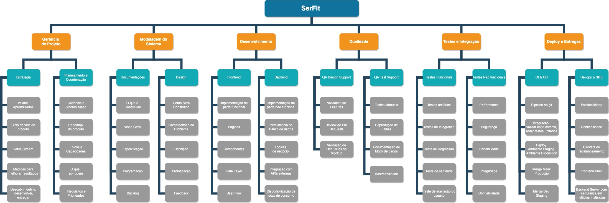

# Estrutura Analítica do Projeto

## 1. EAP

 A WBS é uma ferramenta utilizada para facilitar o gerenciamento de projetos por meio da decomposição hierárquica do escopo do projeto em partes menores. 
 
 Seu principal objetivo é organizar as entregas do projeto. O que deve ser feito para produzir as entregas do projeto.

## 2. Resultado

## 3. Referências

- NASA WBS guidelines, Disponivel em: [NASA Work Breakdown Structure Handbook, NASA/SP-2010-3404](https://web.archive.org/web/20100530070122/http://evm.nasa.gov/docs/Handbooks/Sched_Mgmt_Jan_10/Special_Publication_NASA_WBS_Hdbk_%20Jan_2010.docx), Disponivel em Janeiro 2010
- Planning Engineer, Disponivel em: [how to create work breakdown structure WBS using standard Division of work](http://www.planningengineer.net/how-to-create-work-breakdown-structure-wbs-using-standard-division-of-work/) Acessado em Julho de 2022
- WBS (Work Breakdown Structure), Disponivel em: [EUAX](https://www.euax.com.br/2021/05/wbs/) Acessado em Julho de 2022

## Histórico de Versionamento

| Versão | Alteração            | Autor(es)    | Revisor |
| ------ | -------------------- | ------------ | ------- |
| 1.0    | Criação do documento | Fernando | ---     |
