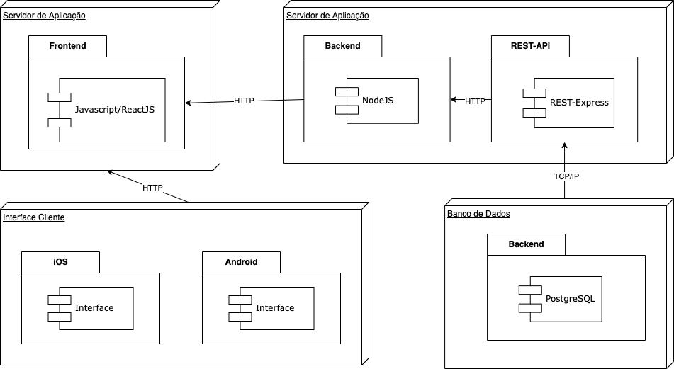

# 2.2.1. Notação UML – Diagramas Estáticos

**Foco_01:** Modelagem UML Estática

Entrega Mínina: Diagrama de Classes, Diagrama de Pacotes, Diagrama de Componentes, e Diagrama de Implantação.

Apresentação (em sala) explicando os principais modelos especificados, com: (i) rastro claro aos membros participantes; (ii) justificativas & senso crítico sobre os modelos; (iii) breve apresentação dos modelos estáticos elaborados, e (iv) comentários gerais sobre iniciativas extras. Tempo da Apresentação: +/- 10min. Recomendação: Apresentar diretamente via Wiki ou GitPages do Projeto.

A Wiki ou GitPages do Projeto deve conter um tópico dedicado ao Módulo Notação UML – Diagramas Estáticos, com artefatos, histórico de versões, referências, e demais detalhamentos gerados pela equipe nesse escopo.

# Diagrama de Implantação

## Introdução

O Diagrama de Implantação, que também pode ser chamado de Diagrama de Implementação, modela a arquitetura física de um sistema, denotando os relacionamentos entre os componentes de software e hardware no sistema e a distribuição física do processamento. Este, que costuma ser  desenvolvidos durante a fase de desenvolvimento da implementação, mostra a organização física dos nós em um sistema distribuído, os artefatos que estão armazenados em cada nó e os componentes e outros elementos que os artefatos implementam. Os **nós** representam dispositivos de hardware, bem como outros dispositivos que suportam o ambiente de tempo de execução de um sistema. Caminhos de comunicação e relacionamentos de implementação modelam as **conexões** do sistema.

Como abordado pela IBM, os diagramas de implementação são eficazes para visualizar, especificar e documentar os seguintes tipos de sistemas:

* Sistemas incorporados que utilizam hardware que é controlado por estímulo externo; por exemplo, um vídeo que é controlado pela alteração de temperatura
* Sistemas cliente/servidor que normalmente distinguem entre a interface com o usuário e os dados persistentes de um sistema
* Sistemas distribuídos que possuem vários servidores e podem hospedar diversas versões de artefatos de software, alguns dos quais podem até migrar de um nó para outro

## Diagrama de Implantação

