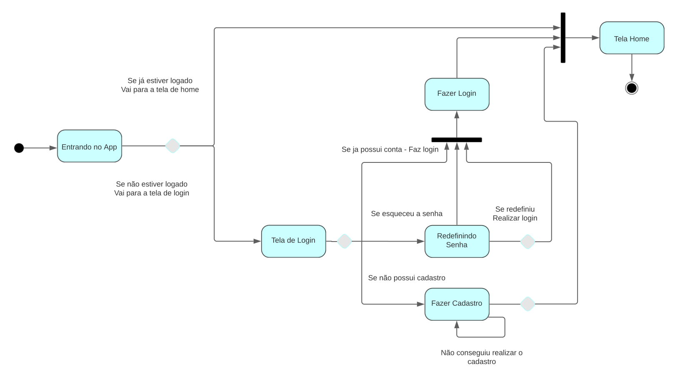

# Diagrama de Estados

## 1. Introdução

O diagrama de estados tem como objetivo, demonstrar os diferentes estados que um objeto pode ter dentro da aplicação do projeto e determinar qual é qual é o estado inicial de determinado objeto, os estados pelos quais ele vai passar, a transição que é responsável pela mudança de estado, e o estado final.

Os diagramas sempre começam por um círculo em preto, este é o estado inicial, as setas representam as transições que é por onde os estados vão passar, até chegar em um novo estado e assim por diante até o estado final que é um círculo contornado. Apesar de ter um fluxo principal esse não é o objetivo do diagrama e sim, os tipos específicos de comportamento que podemos encontrar em cada ocasião.

### 2.1 Legenda
Os diagrama de estados, possuem os seguintes componentes:

| Simbolo                                                        	| Legenda                  	|
|:---------------------------------------------------------------:|:-------------------------:|
|         	| Estado Inicial           	|
|        | Transição                	|
|          	| Estado                   	|
|  	| Pseudo Estado de Escolha 	|
|       	| Conjunção                	|
|    	| Estado Final             	|

<figcaption>Imagem 1: Legenda do Diagrama de Estado .</figcaption>
<figcaption>Autor: Ricardo Loureiro</figcaption>

## 3. Metodologia 

Para a realização dos diagramas utilizamos a plataforma <a href="https://lucidchart.com">LucidChart</a>, e com o grupo foi definido quais diagramas iriam ser feitos.

## 4. Diagramas de Estados

Diante do projeto, a metodologia para desenvolver os diagramas de estado, consistiu, em definir quais eram as principais aplicações e com isso discutir e desenvolver os estados que podemos encontrar no aplicativo. **Entrar no app**, **Cadastrar Treino**.

### 4.1 Entrar no App

### 4.2 Cadastrar Treino