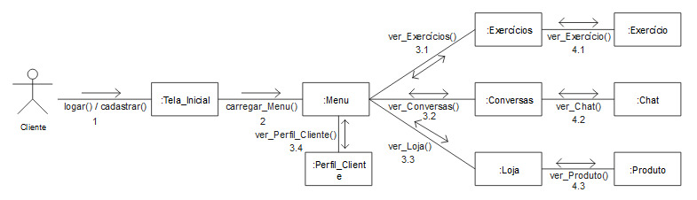
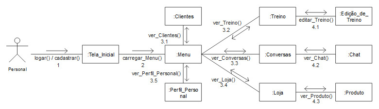

# Diagrama de Comunicação

## 1. Introdução

O diagrama de comunicação é um tipo de diagrama de interação UML que mostra as interações entre objetos e/ou partes usando mensagens sequenciadas em um arranjo de forma livre. A ordem das mensagens normalmente seguem um cenário de uso.
  Os diagramas de comunicação são utilizados pelos designers para definir e esclarecer as funções dos objetos que executam um fluxo específico de eventos de um caso de uso. Eles são a principal fonte de informações usada para determinar interfaces e responsabilidades de classe.
  Basicamente eles tem sua utilização voltada para descrever os objetos que estão interagindo e seus principais elementos sintáticos. Este diagrama corresponde a um formato diferenciado para descrever a interação entre objetos (VARGAS, 2007);

## 2. Metodologia

Os diagramas foram elaborados através da ferramenta LucidChart, que conta com suporte para a notação UML. A escolha desse modelo foi baseada na interação do usuário idealizado e por meio das observações dos requisitos levantados, abordados no diagrama de classes e na etapa de prototipação.

## 2.1 Fluxo do Cliente

## 2.2 Fluxo do Personal

## 3. Conclusão

Com os dois diagramas dinâmicos criados neste documento, temos uma síntese do contexto do sistema sinalizando os principais objetos e sua comunicação. Facilitando no processo de desenvolvimento, ou seja, tendo impacto diretamente na qualidade do produto.

## 4. Referências

* VARGAS, Thânia C. S. (2007). A História de UML e seus Diagramas. Disponível em: https://docplayer.com.br/394702-A-historia-de-uml-e-seus-diagramas.html. Acesso em: 10 de julho de 2022.
* FIGUEIREDO, EDUARDO. Departamento de Ciência da Computação (DCC/ICEx/UFMG). Disponível em: https://homepages.dcc.ufmg.br/~figueiredo/disciplinas/aulas/uml-diagrama-comunicacao_v01.pdf Acesso em: 13 de Julho de 2022.

## Histórico de Versionamento

| Versão | Alteração            | Autor(es)       | Revisor(es) |
| ------ | -------------------- | --------------- | ----------- |
| 1.0    | Criação do documento | Wesley Santos e Victor Hugo| ---         |
| 2.0    | Adição de conteúdo | Wesley Santos e Victor Hugo | ---         |
| 3.0    | Edição do diagrama | Wesley Santos e Victor Hugo | ---         |
