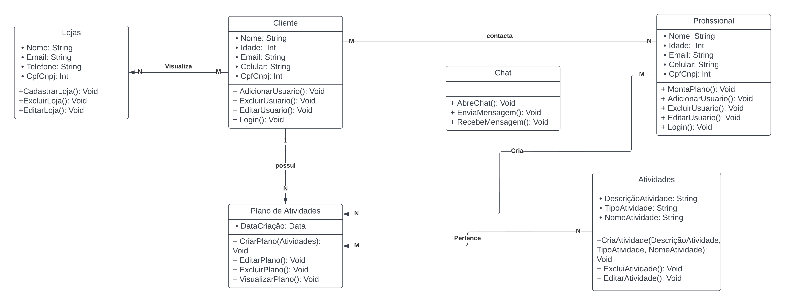

# Diagrama de Classes

## 1. Introdução

Diagramas de classes estão entre os tipos mais úteis de diagramas UML pois mapeiam de forma clara a estrutura de um determinado sistema ao modelar suas classes, seus atributos, operações e relações entre objetos.

Bastante usado por engenheiros de software para documentar arquiteturas de software, os diagramas de classes são um tipo de diagrama da estrutura porque descrevem o que deve estar presente no sistema a ser modelado.

A UML foi criada como um modelo padronizado para descrever uma abordagem de programação orientada ao objeto. Como as classes são os componentes básicos dos objetos, diagramas de classes são os componentes básicos da UML. Os diversos componentes em um diagrama de classes podem representar as classes que serão realmente programadas, os principais objetos ou as interações entre classes e objetos.

## 2. Diagrama de Classes da equipe

## 3. Referências

> O que é um diagrama de classe UML? Disponível em: <https://www.lucidchart.com/pages/pt/o-que-e-diagrama-de-classe-uml>. Acessao em: 13/07/2022

## Histórico de Versionamento

| Versão | Alteração            | Autor(es)        | Revisor         |
| ------ | -------------------- | ---------------- | --------------- |
| 1.0    | Criação do documento | Felipe Andrade   |  |
