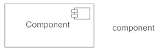
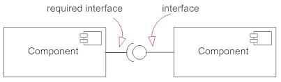
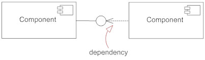
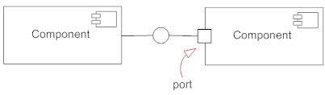

# Diagrama de Componentes

## 1. Introdução
O Diagrama de Componentes fornece uma visão geral de um sistema de software, mostrando o relacionamento entre os diferentes componentes deste sistema [1]. 
Este diagrama geralmente é desenvolvido para ajudar a modelar os detalhes da implementação e para verificar novamente se todos os aspectos dos requisitos do sistema estão sendo cobertos pelo desenvolvimento planejado. [2] 
O Diagrama de componentes é formado pelos seguintes símbolos [2]:

| Nome | Símbolo | Descrição | 
| -- | -- | -- |
| Componente |  | Módulo de classes que representa sistemas ou subsistemas independentes com capacidade de interagir com o restante do sistema [1]. |
| Interface |  | Conjunto de operações que um componente requer ou provém. |
| Dependência |  | Mostra a relação de dependência entre partes distintas do sistema. |
| Porta |  | Ajuda a expor as interfaces de um componente. |

## 2. Metodologia
Com base na documentação já elaborada do projeto, o Diagrama de Componentes foi desenvolvido por meio da plataforma [Draw.io](https://app.diagrams.net/). 
Os membros participantes foram:
<ul>
<li>Lucas Gomes Lopes</li>
<li>Adrian Soares Lopes</li>
</ul>

## 3. Resultados

<h6 align = "center">Figura 1: Diagrama de Componentes   Autores: Lucas Gomes e Adrian Soares</h6>

## 4. Referências

[1] O que é diagrama de componentes UML?. Disponível em https://www.lucidchart.com/pages/pt/diagrama-de-componentes-uml. Acesso em: 10 de Julho de 2022

[2] Component Diagram. Disponível em: https://www.smartdraw.com/component-diagram/#:~:text=A%20component%20diagram%2C%20also%20known,is%20covered%20by%20planned%20development. Acesso em: 10 de Julho de 2022.

## Histórico de Versionamento

| Versão | Alteração                        | Autor(es)    | Revisor(es) |
| ------ | -------------------------------- | ------------ | ----------- |
| 1.0    | Criação do documento             | Lucas Gomes | ---         |
| 2.0    | Adição da descrição dos símbolos do diagrama             | Lucas Gomes | ---         |
| 3.0    | Revisão da v2.0 para v3.0            | --- | Adrian Sares Lopes         |

