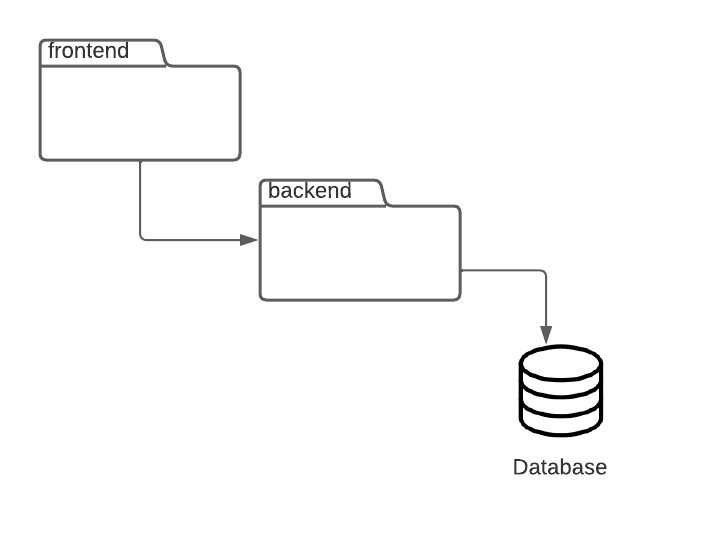
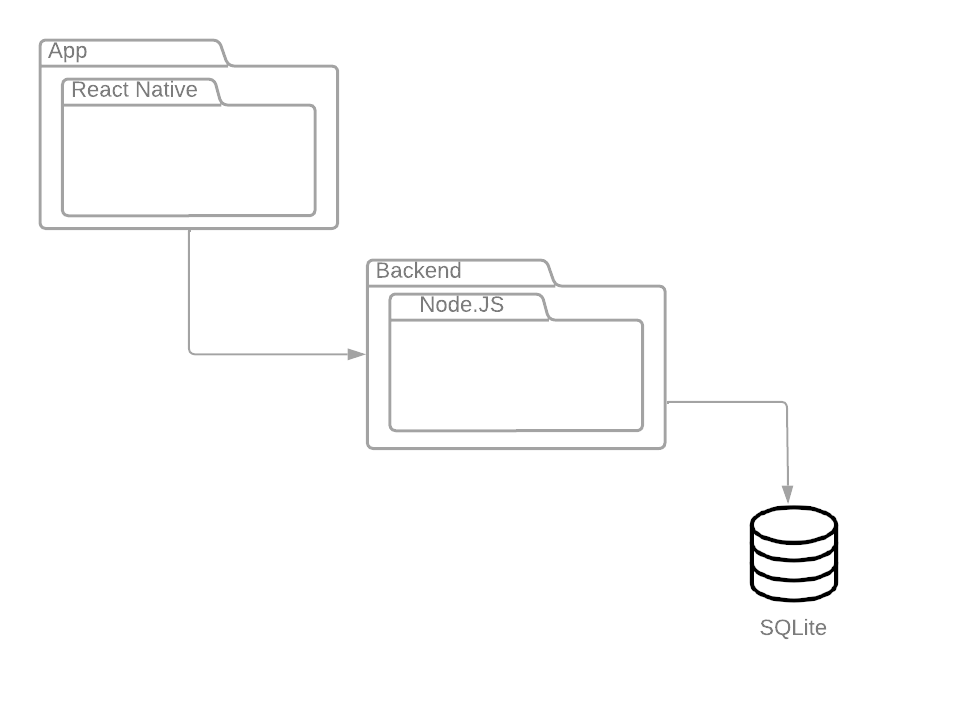
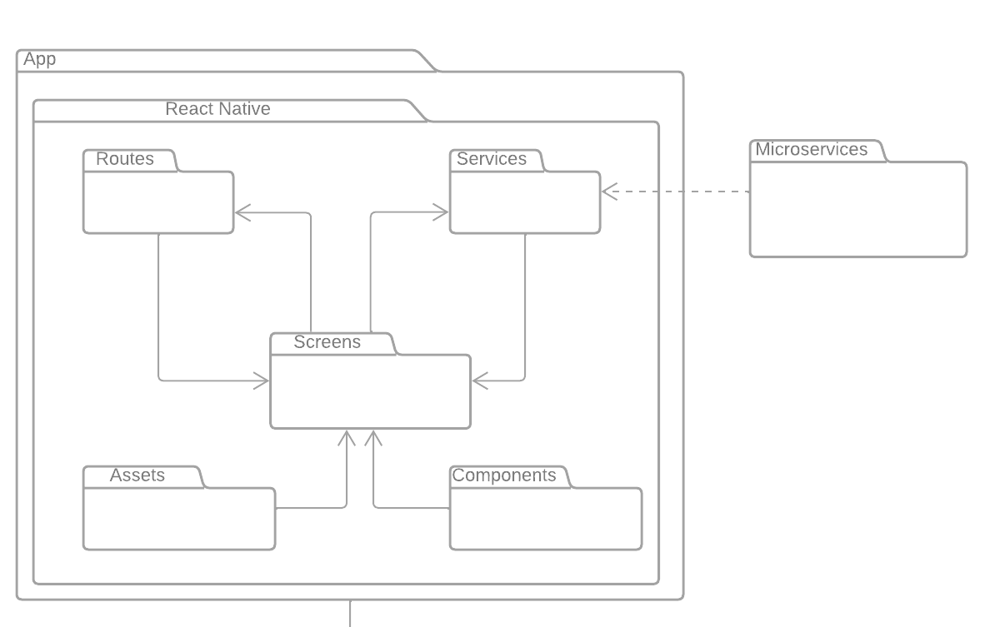
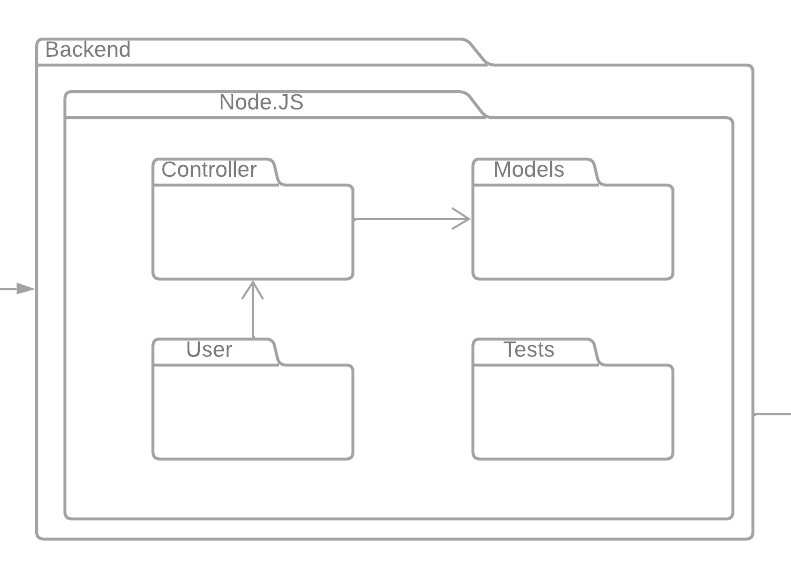

# Diagrama de Pacotes

## 1. Introdução

O Diagrama de pacotes, também conhecido por diagrama de módulos, descreve os pacotes de um sistema divididos em agrupamentos lógicos representando as dependências entre eles. Este diagrama é muito utilizado para ilustrar a arquitetura de um sistema mostrando o agrupamento de suas classes, como também a divisão de seus pacotes em escopo. O presente documento tem por objetivo apresentar um diagrama de pacotes relacionados às tecnologias arquiteturais escolhidos para o projeto, tanto em escopo de backend quanto de frontend.

## 2. Diagramas

Serão apresentados a seguir 4 diagramas que foram produzidos pela equipe de desenvolvimento e que exemplifiquem todos os pacotes arquiteturais do projeto, de acordo com as tecnologias escolhidas.

## 2.1 Diagrama Genérico

## 2.2 Diagrama Genérico com Tecnologias

## 2.3 Diagrama de Pacotes - Frontend

## 2.4 Diagrama de Pacotes - Backend

## 3. Referências

[1] Diagrama de Pacotes. [S. l.], 2022. Disponível em: https://www.lucidchart.com/pages/pt/diagrama-de-pacotes-uml. Acesso em: 26 jun. 2022.

## Histórico de Versionamento

| Versão | Alteração            | Autor(es)       | Revisor(es) |
| ------ | -------------------- | --------------- | ----------- |
| 1.0    | Criação do documento | Gustave Persijn | ---         |
