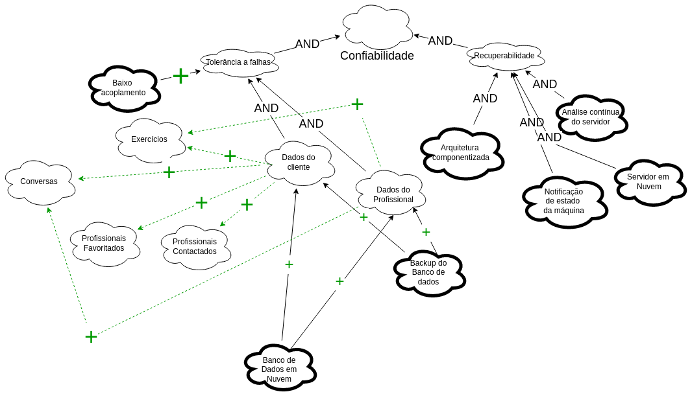
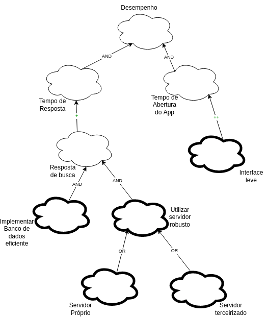
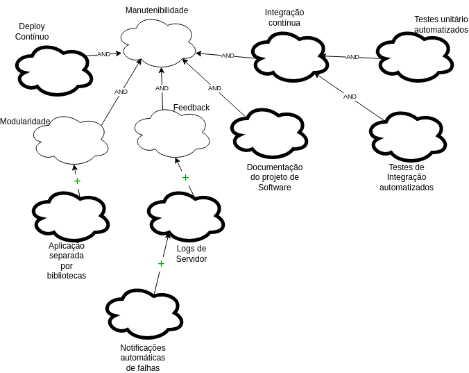
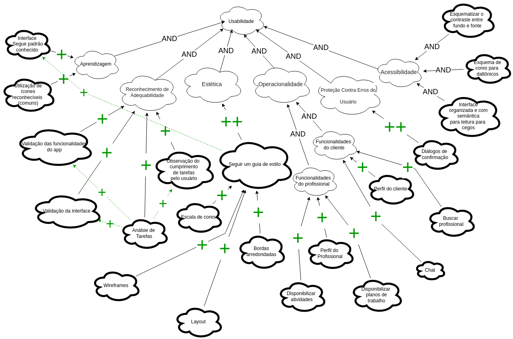

# NFR - Framework

## 1. Introdução

Os Requisitos não Funcionais são um aspecto muito sensível do planejamento e desenvolvimento de Software. Muitas vezes não são triviais de serem percebidos e levantados, pois costumam ter aspecto subjetivo e abstrato, não sendo percebidos da mesma maneira por todos os envolvidos. Eles também tem relações entre si, conflituosas ou harmônicas. Por todas essas dificuldades, geralmente, os requisitos não funcionais são os piores elicitados, com um baixo nível de detalhamento.

O framework NFR (<em>Non Functional Requirements</em>) foi proposto por CHUNG et al (2000), para criar uma abordagem estruturada e com visualização rica e compreensível. Permite uma visualização ampla, auxiliando os desenvolvedores.

O Framework costuma utilizar a representação via grafo SIG, um diagrama com símbolos específicos.

## 2. Metodologia

A partir dos requisitos já levantados no <a href="../priorization/moscow">Moscow</a>, através das técnicas de <a href="../elicitacion/"> elicitação</a>, de boas práticas e da experiência dos usuários e dos envolvidos no projeto, conseguimos analisar esses requisitos não funcionais e atribuir correlações e interdependências através do grafo.

### 2.1. Funcionamento do Framework

#### 2.1.1. Legenda

| Símbolo                                                                                                                             | Legenda                                                                                                                                                                 |
| ----------------------------------------------------------------------------------------------------------------------------------- | ----------------------------------------------------------------------------------------------------------------------------------------------------------------------- |
|                 | Softgoal (Requisito Levantado)                                                                                                                                          |
|              | Operacional (Forma de cumprimento do requisito)                                                                                                                         |
|                | Afirmação (Informações sobre as decisões ou recomendações)                                                                                                              |
|                      | Caso os softgoals descendentes forem satisfeitos os ascendentes também serão                                                                                            |
|                       | Caso algum softgoal descendente for satisfeito, o ascendente também será                                                                                                |
|                     | Contribuição suficientemente positiva entre um softgoal descendente e um ascendente que é concebida no nível mais alto de satisfação                                    |
|                    | Contribuição suficientemente negativa entre um softgoal descendente e um ascendente que é concebida no nível mais alto de negação                                       |
|                     | Contribuição parcialmente positiva entre um softgoal descendente e um ascendente                                                                                        |
|                     | Contribuição parcialmente negativa entre um softgoal descendente e um ascendente                                                                                        |
|                   | Contribuição desconhecida entre um softgoal descendente e um ascendente                                                                                                 |
|                   | O softgoal descendente será satisfeito, apenas se o softgoal ascendente for satisfeito ou o softgoal descendente será negado apenas se o softgoal ascendente for negado |

## 3. NFR

## Referências bibliográficas

> NFR4ES: Um Catálogo de Requisitos Não-Funcionais para Sistemas Embarcados, SILVA, Antônio Reinaldo, Universidade Federal de Pernambuco , Brazil, 2019. CD-ROM.

## Histórico de Versionamento

| Versão | Alteração                        | Autor(es)    | Revisor(es) |
| ------ | -------------------------------- | ------------ | ----------- |
| 1.0    | Criação do documento             |Adrian Soares | ---         |
| 1.1    | Diagrama geral          | Adrian | ---         |
| 1.2    | Diagramas específicos | Adrian | ---         |

