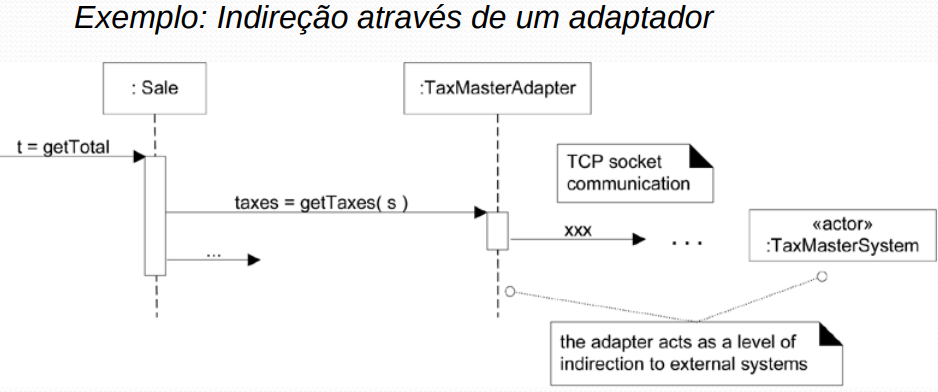

# GRASP - Indireção

## 1. Introdução

O GRASP de indireção, como um princípio/padrão de projeto, traz uma série de benefícios, quando aplicado corretamente a um projeto. Atentando-se para a Indireção, consegue-se, por exemplo, alta coesão e baixo acoplamento ao separar componentes dentro do sistema. A Indireção é a utilização de um objeto intermediário.

## 2. Usabilidade

Através da indireção, pode-se desacoplar duas partes de um sistema que, anteriormente, estariam se comunicando diretamente. A tática é utilizar um componente intermediário para fazer essa comunicação. Na figura 1, podemos ver a utilização de um componente adaptador para requisições TCP para um sistema externo.

<caption>Figura 1: Exemplo de Indireção</caption>

<caption>Fonte: https://www.facom.ufu.br/~bacala/ESOF/05a-Padr%C3%B5es%20GRASP.pdf</caption>

## 3. Aplicação

Em nosso projeto, a indireção acontece em diversos momentos, já que a Arquitetura planejada considera um modelo de camadas. As camadas em si implementam indireção entre as camadas que não são diretamente comunicantes. A utilização de Classes [Controller](#) para a utilização das Classes model e o [MVC](#) são exemplos de uso da indireção no projeto Ser Fit.

## 4. Bibliografia

  [https://edisciplinas.usp.br/pluginfile.php/2186358/mod_resource/content/1/Aula09_GRASP.pdf](https://edisciplinas.usp.br/pluginfile.php/2186358/mod_resource/content/1/Aula09_GRASP.pdf)

  [https://www.facom.ufu.br/~bacala/ESOF/05a-Padr%C3%B5es%20GRASP.pdf](https://www.facom.ufu.br/~bacala/ESOF/05a-Padr%C3%B5es%20GRASP.pdf)

## Histórico de Versionamento

| Versão | Alteração            | Autor(es)       | Revisor(es) |
| ------ | -------------------- | --------------- | ----------- |
| 1.0    | Criação do documento | Adrian Soares   | ----------- |

