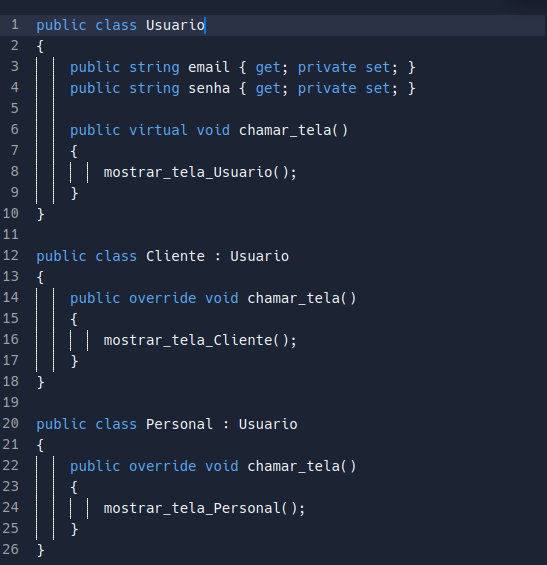

# Polimorfismo

## 1. Introdução

O polimorfismo é um padrão que vem da orientação a objetos, no qual ao utilizar subclasses que se originam de uma superclasse, estas subclasses podem invocar metodos da superclasse e sobreescrevelos, pois em cada subclasses ela se comporta de forma diferente[1]. As responsabilidades devem ser atribuídas a abstrações e não a objetos concretos, permitindo que eles possam variar conforme a necessidade[2].

## 2. Usabilidade

Um exemplo que **não está** sendo usado no projeto, mas ajuda a entender como funciona a ideia de polimorfismo (além de mostrar uma outra alternativa possível de solução para as funcionalidade do aplicativo), seria o de imaginar um usuário genérico que possui uma função para chamar uma tela de menu genérica, mas quando logado, passaria a ser um Cliente ou Personal que chamaria tela de menu respectiva a especialização de usuário.

## 3. Código

O código que implementaria o exemplo de possível uso no projeto seria esse:

<h6 align = "center">
    Imagem 1: Código do exemplo
</h6>

## 4. Referências

[1] VITOR, J. A.; HERONILDO, F. GRASPs. Disponível em: <https://unbarqdsw.github.io/2020.1_G1_Triagil/padroes/grasps/grasps/>. Acesso em: 10 ago. 2022.

‌[2] VILAS, L. B. Padrões GRASP — Padrões de Atribuir Responsabilidades. Disponível em: <https://medium.com/@leandrovboas/padr%C3%B5es-grasp-padr%C3%B5es-de-atribuir-responsabilidades-1ae4351eb204>. Acesso em: 10 ago. 2022.

## Histórico de Versionamento

| Versão | Alteração            | Autor(es)   | Revisor(es) |
| ------ | -------------------- | ----------- | ----------- |
| 1.0    | Criação do documento | Victor Hugo | ---         |
