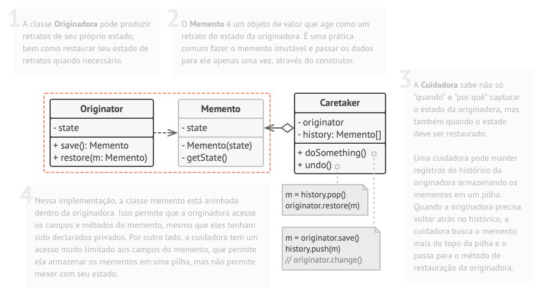

# Memento

## 1. Introdução

O padrão Memento delega a criação dos retratos do estado para o próprio dono do estado, o objeto originador. Portanto, ao invés de outros objetos tentarem copiar o estado do editor “a partir do lado de fora”, a própria classe do editor pode fazer o retrato já que tem acesso total a seu próprio estado.

O padrão sugere armazenar a cópia do estado de um objeto em um objeto especial chamado memento. Os conteúdos de um memento não são acessíveis para qualquer outro objeto exceto aquele que o produziu. Outros objetos podem se comunicar com mementos usando uma interface limitada que pode permitir a recuperação dos metadados do retrato (data de criação, nome a operação efetuada, etc.), mas não ao estado do objeto original contido no retrato. Possui a seguinte estrutura:

Classe Originadora - pode produzir retratos de seu próprio estado, bem como restaurar seu estado de retratos quando necessário.

Memento - é um objeto de valor que age como um retrato do estado da originadora. É uma prática comum fazer o memento imutável e passar os dados para ele apenas uma vez, através do construtor.

Cuidadora / Armazenadora - sabe não só “quando” e “por quê” capturar o estado da originadora, mas também quando o estado deve ser restaurado.

## 2. Usabilidade

O problema desse padrão que **não está** sendo utilizado no projeto, é que por ele sempre estar guardando o estado do objeto, ele pode guardar objetos demais e de maneira desnecessária e assim utilizando muito da memória da máquina, sendo. Mas uma possível utilização genérica dele seria a utilização do memento para desfazer ações de mudança de estado em qualquer ponto do aplicativo, seja em uma tela no front ou dado no backend, como mostrado no código de exemplo.

## 3. Código

  

## 4. Referências

- SHVETS, Alexander. Padrões de Projeto - Padrões comportamentais - Memento. Disponível em: https://refactoring.guru/pt-br/design-patterns/memento. Acesso em: 12/08/2022

- Nícalo; Wagner; Hugo. Padrões de projeto GOFs Comportamentais. Disponível em: https://unbarqdsw2020-2.github.io/2020.2_G2_Encare/Padroes_de_projeto/GOFs/gof_comportamental/#6-memento. Acesso em: 12/08/2022

## Histórico de Versionamento

| Versão | Alteração            | Autor(es)      | Revisor(es) |
| ------ | -------------------- | -------------- | ----------- |
| 1.0    | Criação do documento | Victor Hugo    | Felipe      |
