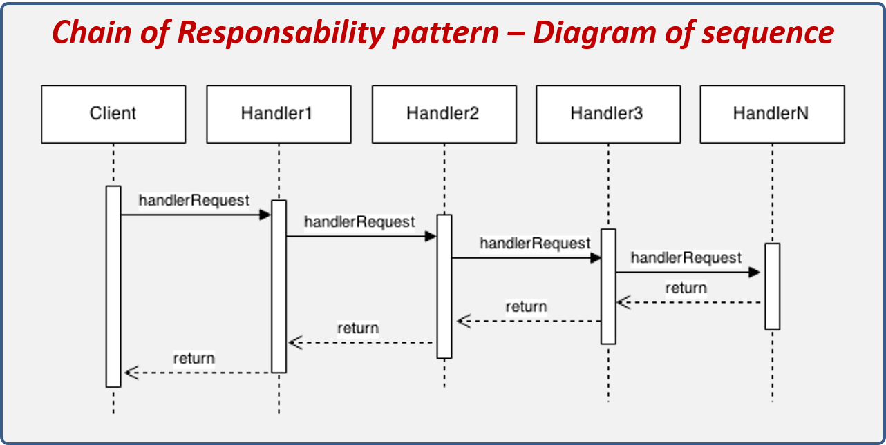
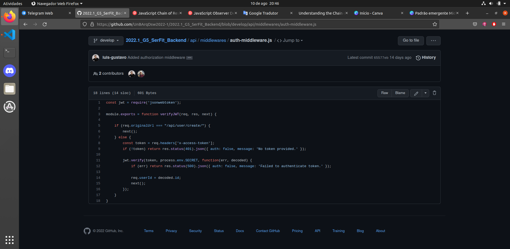

# Chain of Responsibility

## 1. Introdução

O Chain of Responsibility é um padrão de projeto comportamental que permite que você passe pedidos por uma corrente de handlers. Ao receber um pedido, cada handler decide se processa o pedido ou o passa adiante para o próximo handler na corrente.

Um exemplo de Chain of Responsibility é o event-bubbling no qual um evento se propaga por meio de uma série de controles aninhados, um dos quais pode escolher manipular o evento.

## 2. Usabilidade

No caso do nosso projeto, acabamos utilizando o Chain of Responsibility por usarmos o padrão emergente Middleware que é uma derivação do mesmo.

## 3. Aplicação

## 4. Referências

- JavaScript Chain of Responsibility . Disponívem em < <https://www.dofactory.com/javascript/design-patterns/chain-of-responsibility#using> > . Acessado em: 10/08/2022

- Chain of Responsibility . Disponívem em < <https://refactoring.guru/pt-br/design-patterns/chain-of-responsibility> > . Acessado em: 10/08/2022

## Histórico de Versionamento

| Versão | Alteração            | Autor(es)      | Revisor(es) |
| ------ | -------------------- | -------------- | ----------- |
| 1.0    | Criação do documento | Felipe Correia | ---         |
