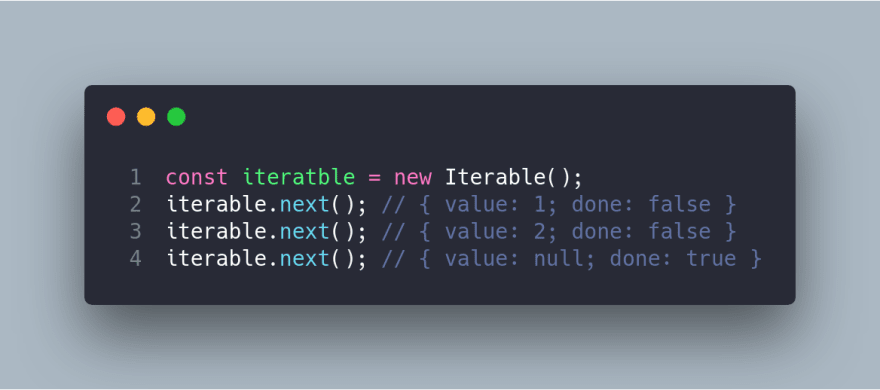

# Iterator

## 1. Introdução

Por ser um padrão de projeto comportamental, que visa a interação entre classes e objetos, o iterator tem como objetivo, encapsular uma iteração

"O padrão Iterator fornece um modo eficiente para percorrer sequencialmente os elementos de uma coleção, sem expor a estrutura interna da coleção". Permitindo acessar, de forma sequencial, os elementos sem expor seu subjacente.

## 2. Usabilidade

Apesar de ser usado no nosso projeto, ainda não foi implementado o interator, basicamente vamos ter uma lista de profissionais e precisamos percorrer por eles para que o cliente possa escolher qual o melhor para as suas necessidades

Podemos ver na imagem abaixo, um exemplo de como se pode implementar um padrão iterator

Criar um interador e ele sai do loop somente quando a chamada next() acha um valor de done, true.

## 3. Conclusão 

O padrão iterator está ligada a sua possibilidade de percorrer estruturas, idependente da sua forma, assim facilita o acesso aos itens de forma sequencial

Na nosso projeto Ser-Fit, usaremos esse padrão em diferentes situações, como, na iteração dos profissionais para o cliente ou na iteração dos exercícios que o profissional adicionar para o treino do seu cliete.

## Bibliografia

- Undestanding Iterator Pattern. [C. c.] Disponível em: https://dev.to/carlillo/understanding-iterator-pattern-in-javascript-typescript-using-symbol-iterator-a19

- Iterator. Disponível em: https://refactoring.guru/pt-br/design-patterns/iterator

## Histórico de Versionamento

| Versão | Alteração | Autor(es) | Revisor(es) |
| --- | --- | --- | --- |
| 1.0 | Criação do documento | Ricardo Loureiro | --- |