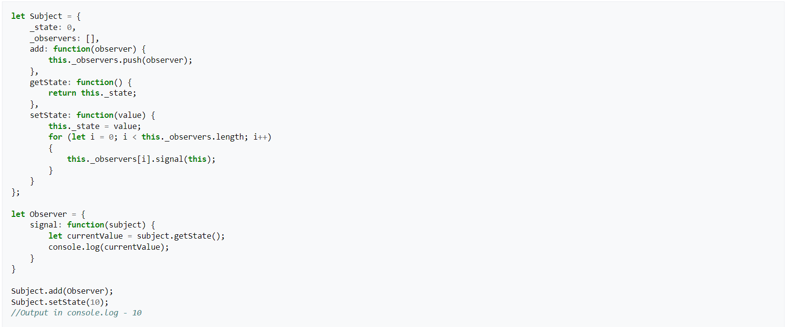

# Observer

## 1. Introdução

O Observer é um padrão de projeto comportamental que permite que você defina um mecanismo de assinatura para notificar múltiplos objetos sobre quaisquer eventos que aconteçam com o objeto que eles estão observando.

O padrão Observer permite que qualquer objeto que implemente a interface possa se inscrever para notificações de eventos em objetos da publicadora. Você pode adicionar o mecanismo de inscrição em seus botões, permitindo que o cliente coloque seu próprio código através de classes assinantes customizadas.

## 2. Usabilidade

Uma das usabilidades é trabalhando com classes de interface gráfica do usuário, por exemplo, você criou classes de botões customizados, e você quer deixar os clientes colocar algum código customizado para seus botões para que ele ative sempre que usuário aperta um botão.

## 3. Aplicação

## 4. Referências

- Observer . Disponívem em < <https://refactoring.guru/pt-br/design-patterns/observer> > . Acessado em: 11/08/2022

- Observer pattern . Disponívem em < <https://en.wikipedia.org/wiki/Observer_pattern> > . Acessado em: 11/08/2022

## Histórico de Versionamento

| Versão | Alteração            | Autor(es)      | Revisor(es) |
| ------ | -------------------- | -------------- | ----------- |
| 1.0    | Criação do documento | Felipe Correia | ---         |
