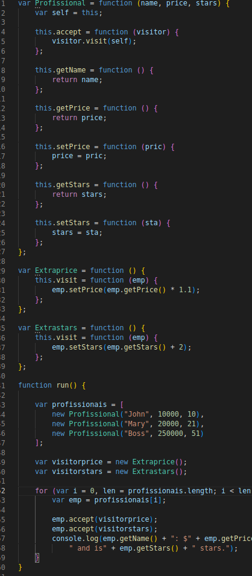

# Factory Method

## 1. Introdução

O objetivo principal do Visitor é abstrair a funcionalidade que pode ser aplicada a uma hierarquia agregada de objetos "element". A abordagem incentiva a criação de classes Element leves - porque a funcionalidade de processamento é removida de sua lista de responsabilidades. Novas funcionalidades podem ser facilmente adicionadas à hierarquia de herança original criando uma nova subclasse Visitor.

O padrão Visitor representa uma operação a ser executada nos elementos de uma estrutura de objeto sem alterar as classes nas quais opera. Esse padrão pode ser observado na operação de uma empresa de táxi, demonstrado na figura abaixo:

## 2. Utilização

O padrão Visitor define uma nova operação ou um conjunto de operações em um objeto ou conjunto de objetos sem alterar os próprios objetos. A nova lógica é implementada em um objeto separado definido como visitante. Se os objetos fornecerem um método de visita aceitando o objeto visitante fazendo alterações no atual, haverá uma maneira perfeita para os clientes implementarem futuras extensões.

## 3. Conclusão

Analisando as características do Visitor, percebemos que, a princípio, não é um padrão que se encaixe no projeto SerFit.

## 4. Referências

- FREFACTORING GURU - Visitor. Disponível em: https://refactoring.guru/pt-br/design-patterns/visitor.
- SOURCE MAKING - Visitor Design Pattern. Disponível em: https://sourcemaking.com/design_patterns/visitor .

## Histórico de Versionamento

| Versão | Alteração | Autor(es) | Revisor(es) |
| --- | --- | --- | --- |
| 1.0 | Criação do documento | Daniel | --- |
