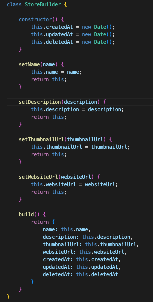
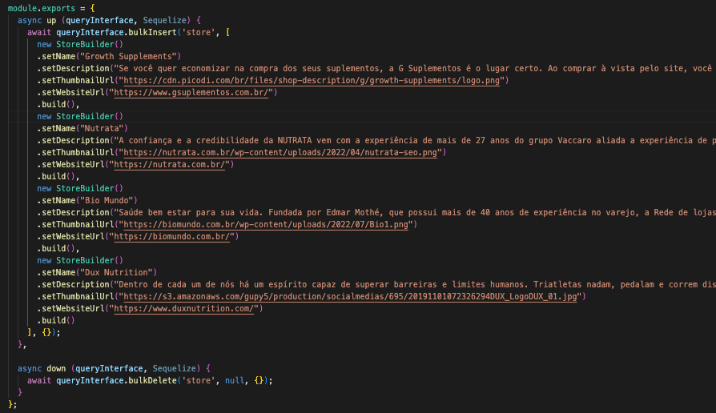

# Builder

## 1. Introdução.

O Builder é um padrão de projeto criacional que permite criar objetos complexos passo a passo. Este permite que produza diferentes tipos e representações de um objeto usando o mesmo código de construção.

A motivação mais comum para usar o Builder é simplificar o código do cliente que cria objetos complexos. O cliente ainda pode direcionar os passos dados pela Construtora sem saber como o trabalho real é realizado. Os construtores frequentemente encapsulam a construção de objetos Composite (outro padrão de projeto GoF) porque os procedimentos envolvidos são muitas vezes repetitivos e complexos.

A imagem abaixo demonstra um exemplo de implementação deste padrão, em que a partir do `HouseBuilder` é possível criar objetos do tipo `Casa` passo a passo, por meio das chamadas de métodos. Neste padrão, os detalhes da construção são totalmente ocultos ao cliente.

## 2. Utilização

A utilização deste padrão de projeto no contexto do projeto deu-se para criação de [seeds](https://sequelize.org/docs/v6/other-topics/migrations/#creating-the-first-seed) para popular o banco de dados, fazendo a criação dos objetos `Store`.

Observa-se na imagem abaixo, que a implementação deste padrão disponibiliza interfaces para criação do objeto `Store` passo a passo, provendo ao cliente criar o objeto da forma e na ordem em que desejar, inclusive utilizando apenas os métodos necessários. Percebe-se também que não evidentes os detalhes da implementação.

A classe `StoreBuilder` é responsável por todos os detalhes da implementação do objeto:

## 3. Conclusão

Assim como no padrão Factory Method, a utilização do padrão Builder no projeto deu-se para criação de seeds para popular o banco de dados. Apesar de serem usados para o mesmo fim, percebe-se a conveniência da criação dos objetos 'passo a passo', que facilita bastante a criação de objetos 'iguais' mas que possuem dados diferentes. Assim, percebe-se que este padrão satifaz bem o que foi proposto no contexto do projeto.

## 4. Links

- Implementação do Builder para criação de objetos `Store`: https://github.com/UnBArqDsw2022-1/2022.1_G5_SerFit_Backend/blob/develop/api/database/seeds/helper/store-builder.js
- Utilização do Builder: https://github.com/UnBArqDsw2022-1/2022.1_G5_SerFit_Backend/blob/develop/api/database/seeds/20220805113523-create-stores.js

## 5. Referências

- SERRANO, Milene. Módulo Padrões de Projeto GoF(s) Criacionais - Material em Slides.
- Jascript Builder. Disponível em: < https://www.dofactory.com/javascript/design-patterns/builder > Acesso em: 08 de Agosto de 2022.
- Builder. Disponível em: < https://refactoring.guru/pt-br/design-patterns/builder > Acesso em: 08 de Agosto de 2022.

## Histórico de Versionamento

| Versão | Alteração | Autor(es) | Revisor(es) |
| --- | --- | --- | --- |
| 1.0 | Criação do documento | Luis Gustavo | --- |
| 1.1 | Adicionado introdução e diagrama com as referências | Luis Gustavo | --- |
| 1.2 | Adicionado implementação do padrão builder e links para os trechos de código | Luis Gustavo | --- |