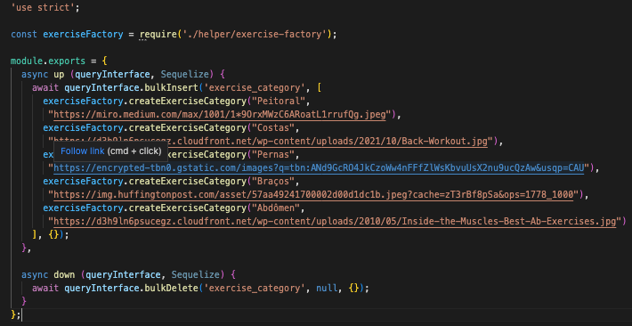
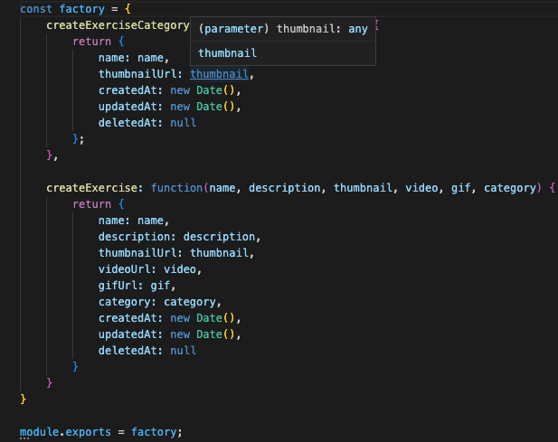

# Factory Method

## 1. Introdução

O Factory Method é um padrão criacional de projeto que fornece uma interface para criar objetos, sem expor a lógica de criação.

O objetivo principal do Factory Method é a extensibilidade, eles são frequentemente usados ​​em aplicativos que gerenciam, mantêm ou manipulam coleções de objetos que são diferentes, mas ao mesmo tempo têm muitas características (ou seja, métodos e propriedades) em comum.

Pode ser observado um exemplo deste padrão na imagem abaixo. Nele percebe-se que, neste padrão, é passado apenas uma função, sem se importar com os detalhes de implementação do objeto

## 2. Utilização

Uma maneira de criar objetos em JavaScript é invocando uma função construtora com o operador `new`. No entanto, existem situações em que o cliente não sabe ou não deve saber qual dos vários objetos candidatos instanciar. O Factory Method permite que o cliente delegue a criação de objetos enquanto ainda mantém o controle sobre qual tipo instanciar.

No projeto foi utilizado este padrão para criação [seeds](https://sequelize.org/docs/v6/other-topics/migrations/#creating-the-first-seed) para popular o banco de dados, criando objetos do tipo `Exercise` e `ExerciseCategory`.

Pode-se observar, na imagem abaixo, que a implementação do padrão factory disponibiliza apenas uma interface para criação dos objetos, não se preocupando com os detalhes de criação deste Objeto.

O `exercise-factory` ficará responsável pela criação deste Objeto:

## 3. Conclusão

A partir da análise do contexto do projeto e da necessidade da funcionalidade, e considerando a particularidade do GOF Factory Method e seus objetivos, acredita que o padrão faz sentido no contexto que foi utilizado, facilitando o processo de popular o banco de dados.

## 4. Links

- Implementação do Factory Method para criação de objetos `Exercise` e `ExerciseCategory`: https://github.com/UnBArqDsw2022-1/2022.1_G5_SerFit_Backend/blob/develop/api/database/seeds/helper/exercise-factory.js
- Utilização do Factory Method: https://github.com/UnBArqDsw2022-1/2022.1_G5_SerFit_Backend/blob/develop/api/database/seeds/20220803202728-create-exercise-category.js

## 5. Referências

- SERRANO, Milene. Módulo Padrões de Projeto GoF(s) Criacionais - Material em Slides.
- Factory Method. Disponível em: < https://refactoring.guru/pt-br/design-patterns/factory-method > Acesso em: 08 de Agosto de 2022.
- Jascript Factory Method. Disponível em: < https://www.dofactory.com/javascript/design-patterns/factory-method > Acesso em: 08 de Agosto de 2022.

## Histórico de Versionamento

| Versão | Alteração | Autor(es) | Revisor(es) |
| --- | --- | --- | --- |
| 1.0 | Criação do documento | Luis Gustavo | --- |
| 1.1 | Adicionado introdução com as referências | Luis Gustavo | --- |
| 1.2 | Adicionado implementação no projeto e links | Luis Gustavo | --- |
