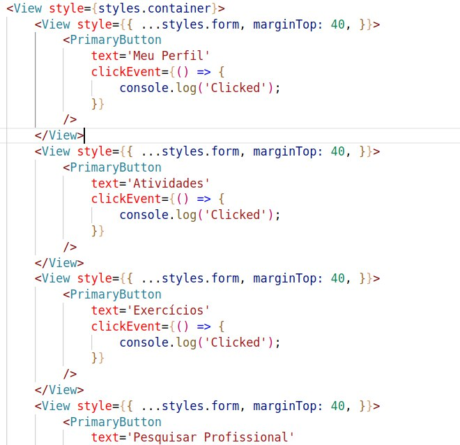

# Multiton

## 1. Introdução

Na engenharia de software, o padrão multiton é um padrão de projeto que generaliza o padrão singleton. Enquanto o singleton permite a criação de apenas uma instância de uma classe, o padrão multiton permite a criação controlada de várias instâncias, que são gerenciadas por meio de um Map.

## 2. Usabilidade

No nosso projeto Serfit o padrão multiton foi aplicado na parte menu com os botões sendo instanciados de forma controlada por meio de um Map, podendo assim ter uma maior organização, facilicade na instanciação e poder ter um controle melhor para futuras modificações no código.

## 3. Aplicação

## 4. Referências

- Multiton Pattern. Disponível em < <https://en.wikipedia.org/wiki/Multiton_pattern> > . Acesso em: 08 de Agosto de 2022

## Histórico de Versionamento

| Versão | Alteração            | Autor(es)      | Revisor(es) |
| ------ | -------------------- | -------------- | ----------- |
| 1.0    | Criação do documento | Felipe Correia | ---         |
