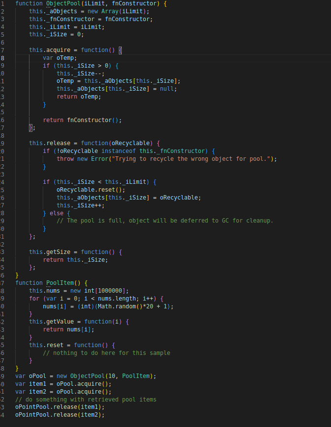

# Object Pool

## 1. Introdução.

O Object Pool é um padrão de projeto criacional, não utilizado no projeto, que permite uma significativa melhora de desempenho do projeto, uma vez que garante uma diminuição na quantidade de instânciamento realizado em classes de maior dificuldade de inicialização.

A principal motivação para se utilizar desse padrão de projeto é aumentar a performance do projeto, pois um cliente pode pedir um objeto para a pool de objetos sem se preocupar com a sua inicialização, pois os objetos nessa pool já foram iniciados fazendo com que o tempo gasto no instânciamento de um objeto diminua consideravelmente.

A imagem abaixo demonstra um exemplo de como funcionaria considerando que o Warehouse se comporta como uma object pool.

## 2. Usabilidade

Apesar de não utilizado no projeto, o Object Pool permite uma melhora significatica na performace de um determinado projeto .

Observa-se na imagem abaixo, que a implementação deste padrão permite pegar elemento de forma rápida pois já foi iniciado pelo pela pool e além disso permite o cliente reutilizar um objeto já utilizado anteriormente. 

## 3. Conclusão

O padrão Object Pool tem a capacidade de oferecer um bom ganho de performance para o projeto, porém possui casos de uso bastante específicos e são, normalmente, implementadas como singleton. A equipe não viu, até o momento, nenhum cenário de utilização do padrão Object Pool no projeto, e não deve seguir adiante com este padrão.

## 4. Referências

- Object Pool Design Pattern. [S. l.]. Disponível em: https://sourcemaking.com/design_patterns/object_pool.

- Object Pool Design Pattern. [S. l.]. Disponível em: https://www.geeksforgeeks.org/object-pool-design-pattern/. 

- SHAUGHNESSY, Jerry. OBJECT POOL PATTERN. Disponível em: https://itdesigner.github.io/standards/patterns/gof-objectpool.html.

- HTML5 Gamer. JAVASCRIPT OBJECT POOL. Disponível em: https://blog.sklambert.com/javascript-object-pool/.

## Histórico de Versionamento

| Versão | Alteração | Autor(es) | Revisor(es) |
| --- | --- | --- | --- |
| 1.0 | Criação do documento | Daniel | --- |
