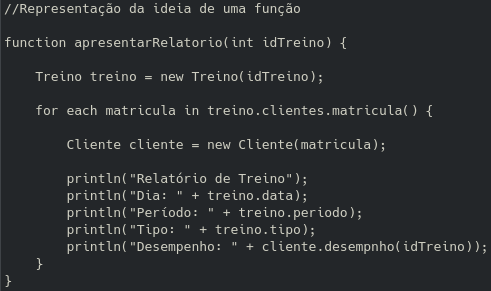

# Flyweight

## 1. Introdução

O principal objetivo do padrão de projeto Flyweight é melhorar o desempenho de um procedimento através de compartilhamento de objetos com características similares. Em outras palavras, o padrão provê um mecanismo para utilizar objetos já existentes, modificando suas propriedades conforme solicitado, ao invés da necessidade de sempre instanciá-los.

Para facilitar a compreensão, podemos imaginar o Flyweight como uma “área de cache de objetos”. Quando precisamos utilizar um objeto de uma mesma classe pela segunda vez, mas com propriedades modificadas, em vez de instanciá-lo novamente, buscamos o objeto nesse cache, poupando um novo procedimento de instanciação. É por este motivo que utilizamos o termo “compartilhamento de objetos”.

O Flyweight fornece recursos para alterar algumas propriedades dos objetos compartilhados. Para isso, cada objeto Flyweight possui dois tipos de propriedades:

- Intrínsecas: propriedades imutáveis, ou seja, que caracterizam o objeto compartilhado.
- Extrínsecas: propriedades variáveis que podem receber novos valores a cada acesso.

## 2. Usabilidade

Um exemplo de implementação _flyweight_ que **não está** sendo utilizado no projeto, mas serviria como uma _feature_ extra, seria a funcionalidade que geraria automaticamente um relatório de desempenho para cada cliente a partir de um respectivo treino ocorrido em um momento específico. Tendo em vista que o relatório traria o desempenho que é algo que varia pra cada cliente, ou seja, uma propriedade _extrínseca_ e o treino que para aquela ocasião é o mesmo para todos os relatórios, uma propriedade intrínseca, o flyweight permitiria que seja instanciado na memória apenas uma vez a classe Treino para que a função que gera os relatórios acesse quantas vezes forem necessárias para cada instância da classe Cliente.

## 3. Aplicação

O _treino_ é instanciado apenas uma vez enquanto há varias instâncias de _cliente_.

## 4. Referências

- CELESTINO, André. [Delphi] Design Patterns GoF – Flyweight. Disponível em: https://www.andrecelestino.com/delphi-design-patterns-flyweight/. Acesso em: 11/08/2022

- SERRANO, Milene. 09e - Vídeo-Aula - DSW - GoFs - Estruturais - Flyweight. Disponível em: https://aprender3.unb.br/pluginfile.php/2083415/mod_label/intro/Arquitetura%20e%20Desenho%20de%20Software%20-%20Aula%20GoFs%20Estruturais%20-%20Profa.%20Milene.pdf. Acesso em: 11/08

## Histórico de Versionamento

| Versão | Alteração            | Autor(es)   | Revisor(es) |
| ------ | -------------------- | ----------- | ----------- |
| 1.0    | Criação do documento | Victor Hugo | ----------- |
