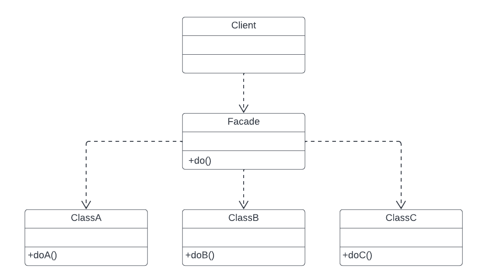

# Facade

## 1. Introdução 

O Facade nos fornece uma interface simplificada capaz de centralizar a utilização de várias interfaces de um sistema. Esse padrão de projeto oculta a complexidade de uma ou mais classes através de uma Facade, assim, possibilitando a simplificação da utilização de um subsistema complexo ao implementar uma classe que fornece uma interface única e mais razoável.

## 2. Usabilidade 

O padrão Facade será utilizado no nosso projeto no contexto de omitir alguns componentes do front-end, como exemplo a Navbar do nosso aplicativo.

## 3. Conclusão

O padrão facade é uma boa funcionalidade para operacões que requerem um conjunto de classes, que devem seguir uma determinada organização, fazendo que tal operação seja complexa. Assim tornar a realização dessa atividade mais fácil e intuitivo para o usuário. O grupo vai utilizar do padrão facade nas rotas do navbar entre as telas do aplicativo.

## 4. Bibliografia

- Facade. [S. l.]. Disponível em: https://refactoring.guru/pt-br/design-patterns/facade

- Facade Design Pattern. [S. l.]. Disponível em: https://sourcemaking.com/design_patterns/facade