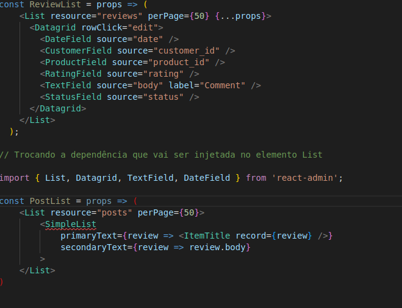

# Injeção de Dependência

## 1. Introdução.

Com a utilização desse padrão é possível obter uma melhor separação de interesses, podendo entender melhor sua interface de usuário.
Uma das principais características do uso desse padrão é o potencial de reutilização que se pode obter, podendo utilizar os componentes criados em vários ambientes distintos.

## 2. Usabilidade

A utilização deste padrão de projeto no contexto do projeto pode ser utilizado no contexto de React, pois O React oferece injeção de dependência sem precisar de um contêiner de injeção de dependência, graças ao JSX. Permitindo dessa forma, economizar tempo e obter uma melhoria de performance no desolvimento do projeto e sua manutenabilidade.

Observa-se na imagem abaixo, um exemplo de código que exemplificar esse conceito:

## 3. Conclusão

Com isso, é possível constatar que a utilização do padrão de Injeção de Depedência é bastante simples e adiciona muitas vantagens ao código. É possível, dessa forma, desenvolver aplicações manuteníveis, eficientes e testáveis. No contexto da aplicação, é possível utilizá-lo em diversas partes do código, principalmente no contexto do frontend do aplicativo.

## 4. Referências

- OPENREPLAY. 3 React component Design Patterns you should know about. Disponível em: https://blog.openreplay.com/3-react-component-design-patterns-you-should-know-about. Acesso em: 17/03/2022.
- MEDIUM. DEPENDENCY INJECTION IN JAVASCRIPT. Disponível em: https://medium.com/geekculture/dependency-injection-in-javascript-2d2e4ad9df49. Acesso em: 3 mar. 2022

## Histórico de Versionamento

| Versão | Alteração            | Autor(es) | Revisor(es) |
| ------ | -------------------- | --------- | ----------- |
| 1.0    | Criação do documento | Daniel    | ---         |
