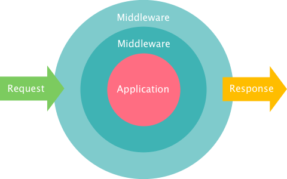
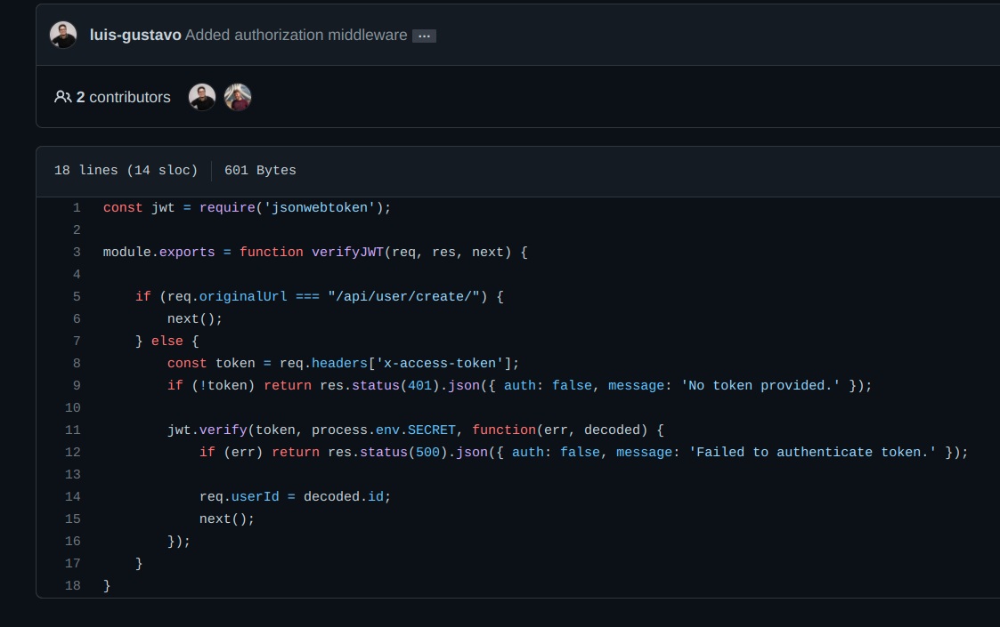

# Middleware

## 1. Introdução

O padrão emergente Middleware é um padrão que age como uma “camada” capaz de fazer a mediação entre várias tecnologias de software, de modo que as informações (de diferentes fontes) são movidas ao mesmo tempo que suas diferenças de protocolos, plataformas, arquiteturas, ambientes e sistemas operacionais não interferem no processo. 

 Um dos principais problemas que o middleware resolve é a forma da qual podem ser preservadas as informações de sessão após o login de um usuário. Os middlewares comunicam com as requisições fazendo alterações/persistência na solicitação e nos objetos de resposta, proporcionando, assim, mais segurança e confiabilidade durante o processo.

## 2. Usabilidade

No escopo do projeto e tecnologias do aplicativo SerFit, as funções de middleware são funções que têm acesso ao objeto de requisição (req), ao objeto de resposta (res) e à função next no ciclo de req-res do aplicativo. A função next é uma função no Router Express que, quando chamada, executa o middleware sucessor do middleware atual.

Algumas vantagens do middleware são:

- Cria uniformidade no nível da interface;
- Economiza tempo porque um conjunto de serviços são comuns às diferentes aplicações;
- Oculta a heterogeneidade de aplicativos dos usuários;
- Permite a comunicação offline entre aplicativos;
- Agrega em segurança e confiabilidade nas requisições.

## 3. Aplicação

Uma aplicação do middleware no nosso projeto pode ser identificado na imagem abaixo, em que o padrão foi utilizado no processo de autenticação junto com o token JWT:

## 4. Bibliografia

> Creating Middleware on Express. Disponível em <https://www.digitalocean.com/community/tutorials/nodejs-creating-your-own-express-middleware>
> Middleware Guide. Disponível em <https://expressjs.com/en/guide/writing-middleware.html>

## Histórico de Versionamento

| Versão | Alteração            | Autor(es)       | Revisor |
| ------ | -------------------- | --------------- | ------- |
| 1.0    | Criação do documento | Gustave Persijn | ---     |
| 1.1    | Revisão do documento |  Lucas Gomes | ---     |

