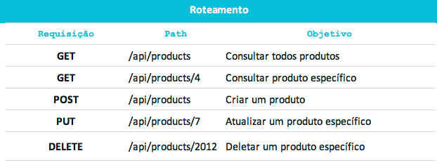
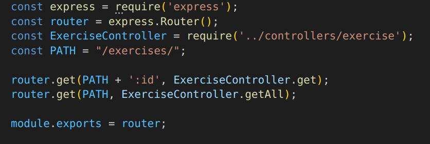
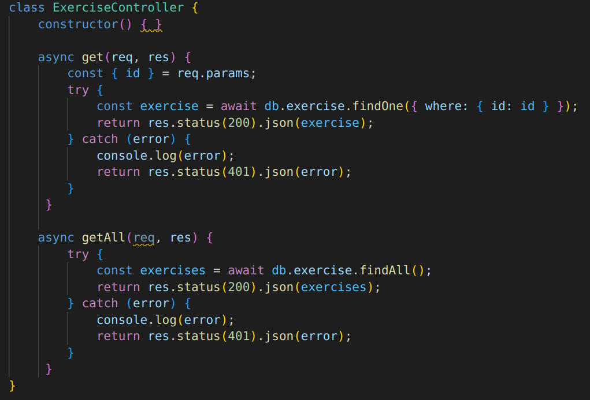

# REST

## 1. Introdução

O REST é um padrão emergente arquitetural, ele fornece padrões que implementar a forma que se da a comunicação entre os diversos sistemas. REST é um acrônimo para Representational State Transfer, sendo o RESTFul o termo que se é utilizado para as API's HTTP que adotaram esse padrão. Esse padrão costuma ser bem usado devido à expansão dos projetos orientados aos microsserviços. Os princípios do REST são:

- Client-Server: Separar as responsabilidades do frontend e do backend

- Stateless: O serviço não mantém estado, em que cada solicitação deve possuir seu próprio entendimento.

- Cacheable: A resposta de uma solicitação deve informar se o dado pode ou não ser mantido em cache.

- Uniform interface: para identificar e manipular recursos.

## 2. Usabilidade

O exemplo abaixo representa alguns tipos de requisições que são derivados desse padrão API REST, das quais se criam endpoints para mapear algumas funcionalidades, sendo as principais: GET, POST, PUT e DELETE, conforme a imagem abaixo:

## 3. Aplicação

Partindo-se para o escopo do projeto SerFit, o padrão emergente REST pode ser encontrado através da criação dos endpoints e também na análise de comunicação entre o frontend e o backend, tendo suas responsabilidades isoladas, como sugere os princípios do REST. Dessa forma, um exemplo de um endpoint criado na aplicação do projeto é: 

Chamada dos endpoint na rota:

Endpoint get no controller:

## 4. Bibliografia

> REST Pattern. Disponível em https://www.brunobrito.net.br/padrao-rest/
> Martin, Robert C.. Clean Code (Robert C. Martin Series)
> REST x RESTFul .Disponível em: https://wssilva-willian.medium.com/design-de-api-rest-9807a5b16c9f

## Histórico de Versionamento

| Versão | Alteração            | Autor(es)       | Revisor |
| ------ | -------------------- | --------------- | ------- |
| 1.0    | Criação do documento | Gustave Persijn | ---     |
