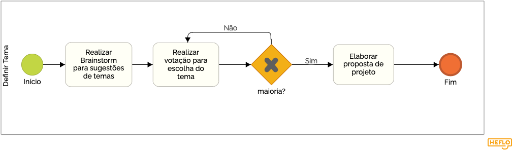
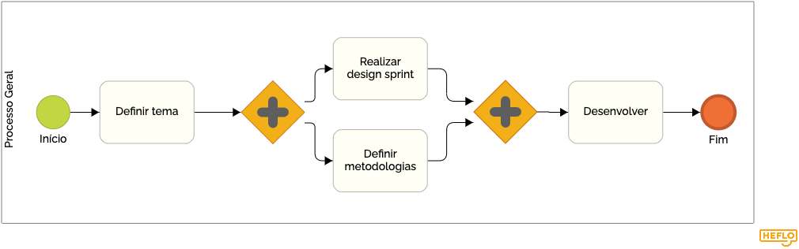
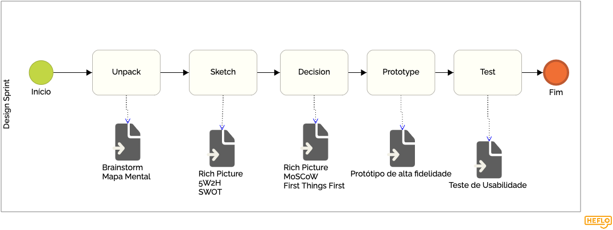
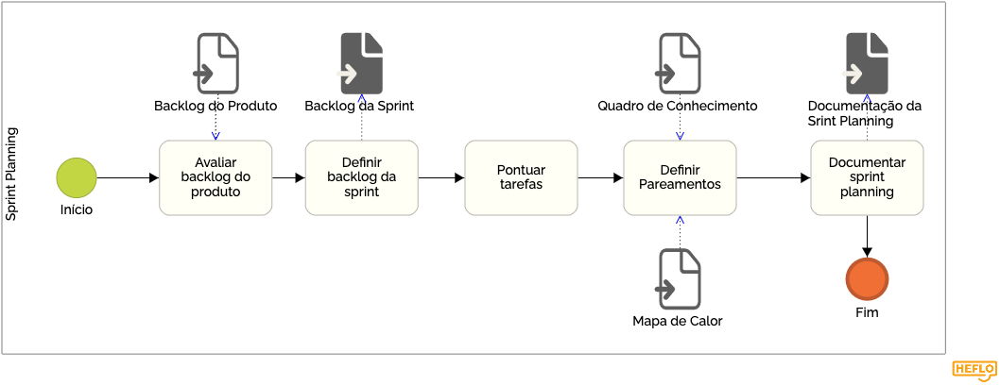
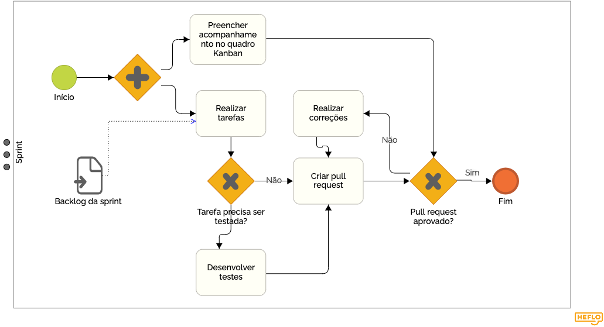
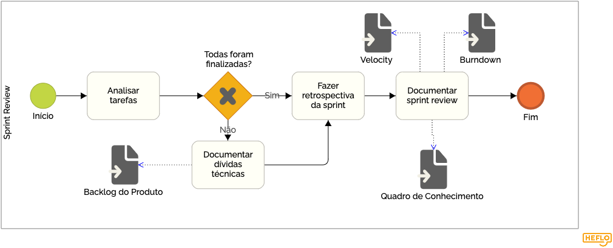

# Metodologia BPMN

## 1. Introdução

O BPMN (*Business Process Model and Notation*) é um método de fluxograma que modela as etapas de um processo de negócios planejado. Esta notação representa de forma visual uma sequência detalhada de atividades de negócios e fluxos de informação necessários para concluir um processo. Tem como principal objetivo é modelar formas de melhorar a eficiência, representar novas circunstâncias ou ganhar vantagem competitiva.

A notação BPMN foi utilizada para modelar, de forma gráfica e de fácil entendimento, as principais etapas do projeto.

## 2. Modelagem

### 2.1 Definição do Tema

### 2.2 Processo Geral

### 2.2 Design Sprint

### 2.2 Sprint Planning

### 2.2 Sprint

### 2.2 Sprint Review

## 3. Referências

* O que é BPMN. Disponível em: < https://www.lucidchart.com/pages/pt/o-que-e-bpmn > Acesso em: 22 de Junho de 2022
* SERRANO, Milene. BPMN, 2022. Vídeo-aulas apresentadas na Disciplina de Arquitetura e Desenho de Software do curso de engenharia de software da UnB, FGA. Acesso em: 22 de Junho de 2022.

## Histórico de Versionamento

Versão |       Alteração       |    Autor(es)   |    Revisor(es) 
--- | --- | --- | --- 
1.0 | Criação do documento | Luis Gustavo |  --- 
1.1 | Modelagem dos processos | Luis Gustavo |  --- 
1.2 | Adição da modelagem ao documento | Luis Gustavo |  --- 