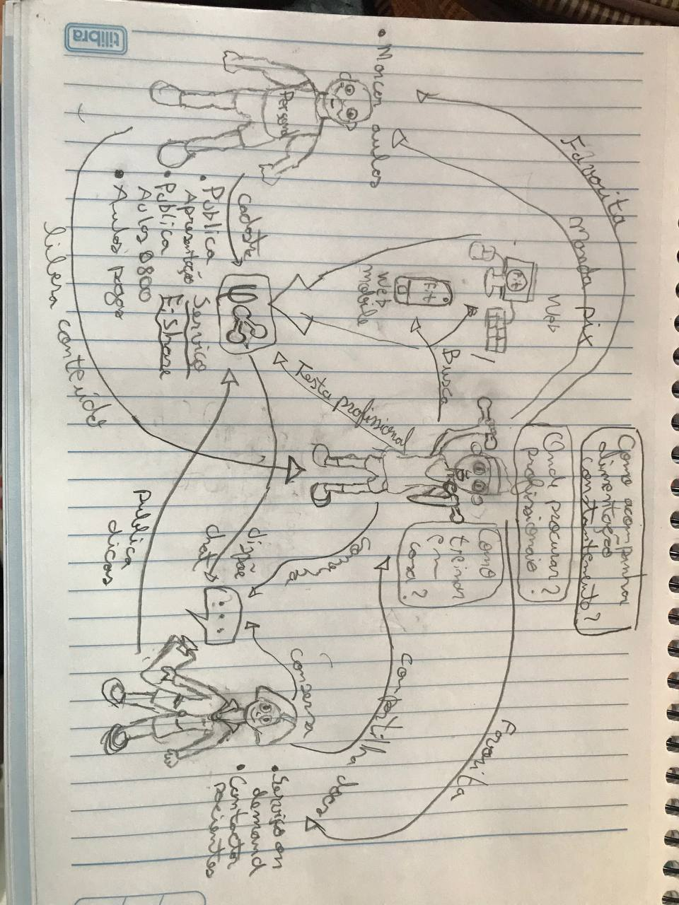
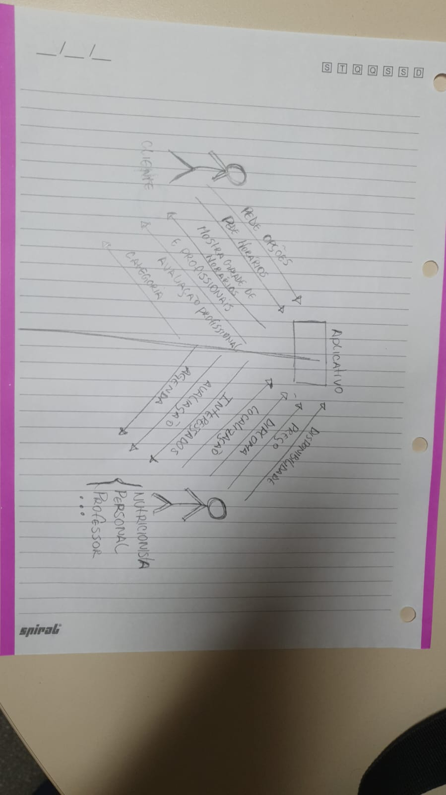
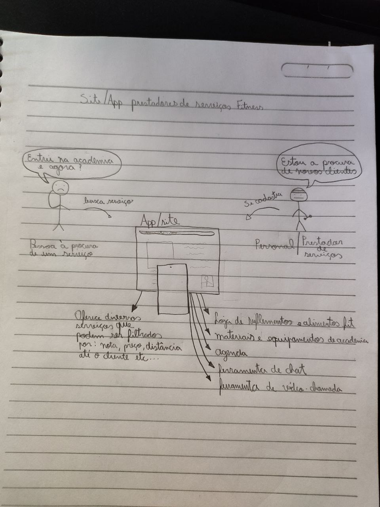
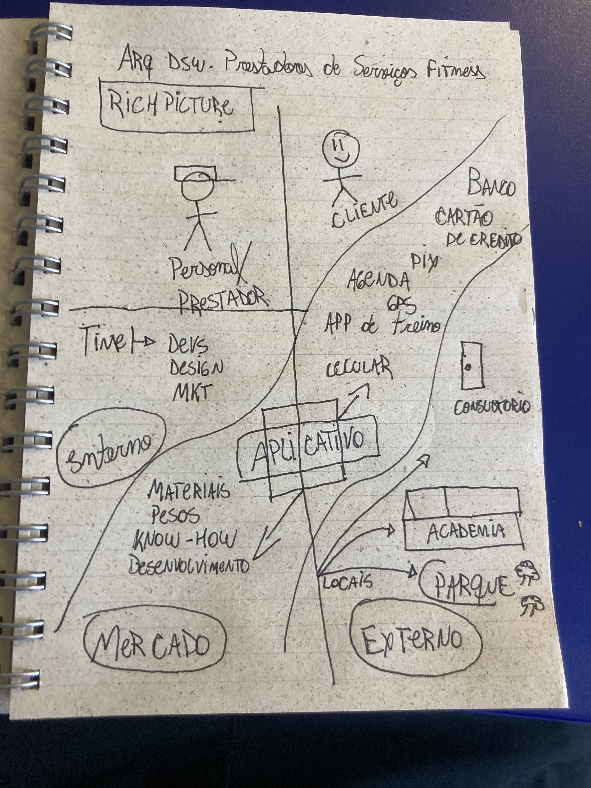
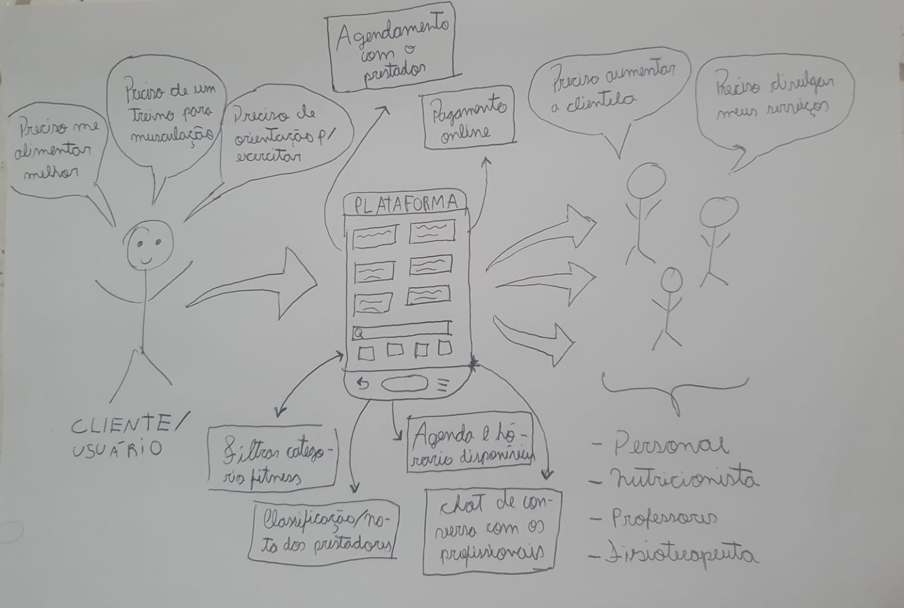
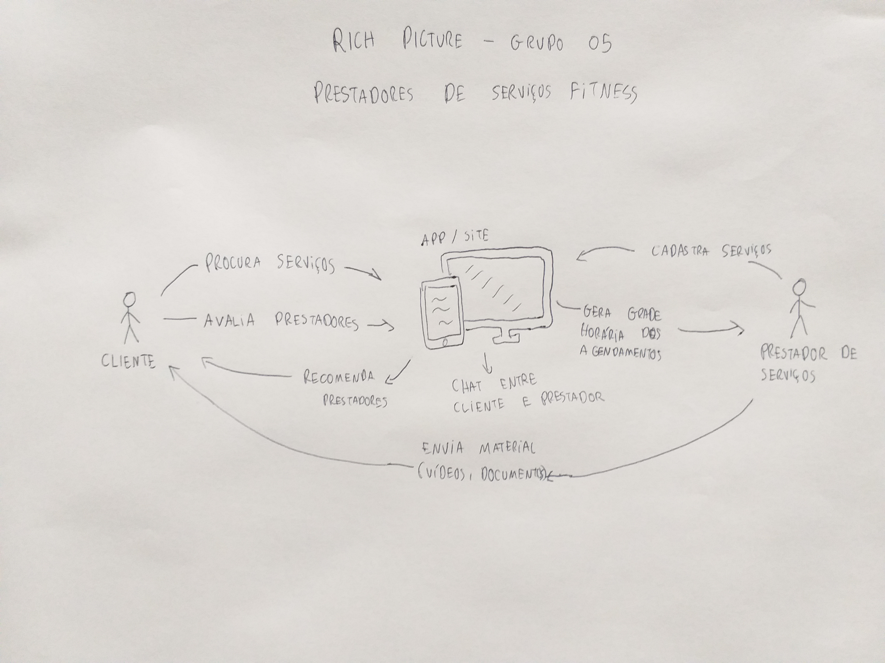
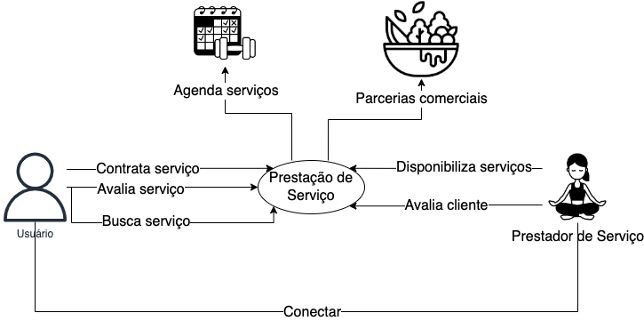
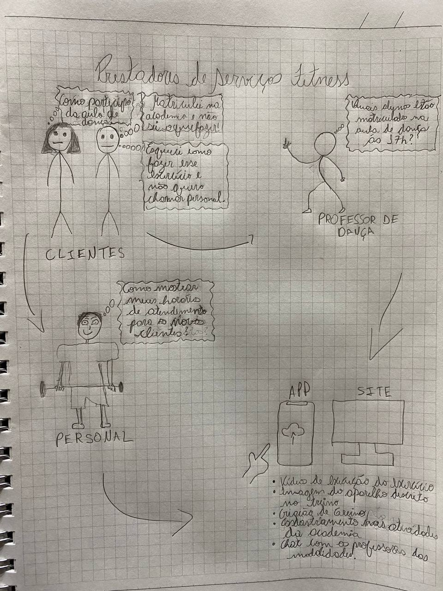

# Metodologia

## 1. Introdução

Rich Picture é um artefato visual que permite explorar, reconhecer e definir uma situação e expressar pensamentos através de diagramas para criar um modelo mental preliminar. Um Rich Picture pode ajudar a abrir uma discursão e chegar a um entendimento geral de uma situação. Muito utilizad como forma de rascunho, sendo recomendado que sejam utilizados elementos gráficos como desenhos e ilustrações.

## 2. Metodologia

O grupo optou por utilizar o artefato como uma forma de elucidar as ideias dos membros sobre o conceito geral do produto que se planeja desenvolver. Após realizar um Brainstorm, cada membro ficou responsável por criar um Rich Picture baseado no que havia sido debatido e enviá-lo à [issue #7](https://github.com/UnBArqDsw2022-1/2022_1_grupo5/issues/7) no github. Após isso, deverá ser realizado com todos os integrantes do grupo para centralização de um Rich Picture que englobe o acordo geral do grupo sobre o projeto.

## 3. Resultado

## 3.1 Individuais

### 3.1.1 Adrian Soares

### 3.1.2 Daniel Vinicius

### 3.1.3 Felipe Correia

### 3.1.4 Fernando Ribeiro

### 3.1.5 Gustave Persijn

### 3.1.6 Lucas Gomes

### 3.1.7 Luis Gustavo

### 3.1.8 Victor Hugo

### 3.1.9 Wesley Santos

## 3. Referências

* SERRANO, Maurício; SERRANO, Milene. Requisitos - Aula 4. 1º/2019. 37 slides. Material apresentado para a disciplina de Requisitos de Software no curso de Engenharia de Software da UnB, FGA.
* SERRANO, Milene. 02c - VídeoAula - DSW - Base - RichPicture. Material apresentado para a disciplina de Arquitetura e Desenho de Software no curso de Engenharia de Software da Universidade de Brasília, FGA.

## Histórico de Versionamento

 Versão |       Alteração       |    Autor(es)   |    Revisor(es)
  ---   |          ---          |       ---      |      ---
  1.0 |  Criação do documento com introdução, metodologia e referências |  Luis Gustavo | ---
  1.1 |  Adição dos Rich Pictures individuais |  Luis Gustavo | ---