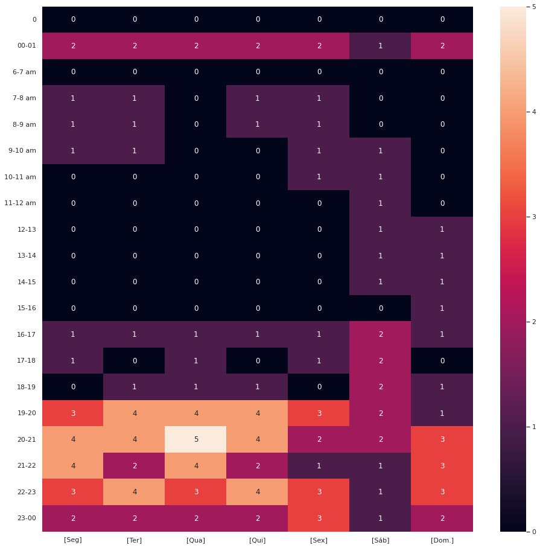

# Disponibilidade de Horários

## 1. Heatmap
Heatmap é uma representação gráfica de dados em que os valores individuais contidos em uma matriz são representados como cores. Então foi construído um Heatmap para obter uma melhor disponibilidade entre os integrantes da equipe para a realizações de reuniões e discursos sobre o andamento do projeto. Segue abaixo o Heatmap da equipe:

## 2. Resultado

## 3. Referências
* SCRUM. Disponível em: https://www.desenvolvimentoagil.com.br/scrum/ Acesso em: 24 de outubro de 2019.
* EXTREME PROGRAMMING. Disponível em: https://www.desenvolvimentoagil.com.br/xp/ Acesso em: 24 de outubro de 2019.

## Histórico de Versionamento

 Versão |       Alteração       |    Autor(es)   |    Revisor
  ---   |          ---          |       ---      |      ---
  1.0 |  Criação do documento |  Luis Gustavo | ---