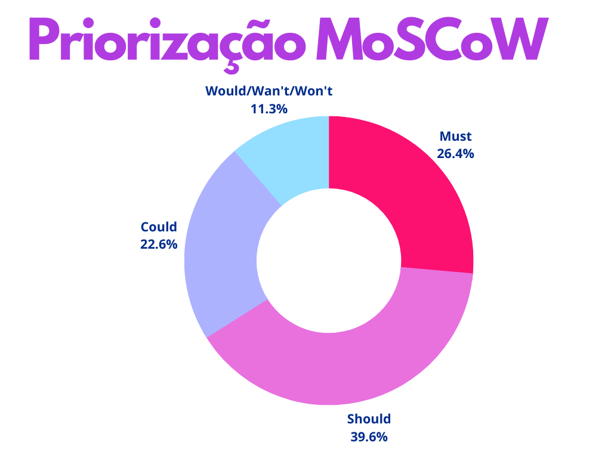

# Priorição MoSCoW

## 1. Introdução

Em um projeto de Engenharia de Software, em que o tempo é fixo, é necessário entender a importância relativa do trabalho a ser feito para progredir e cumprir os prazos. A priorização pode ser aplicada a requisitos/histórias de usuário, tarefas, produtos, casos de uso, critérios de aceitação e testes, embora seja mais comumente aplicada a requisitos/histórias de usuário.

O MoSCoW é um framework de priorização de funcionalidades desenvolvido por Dai Clegg na Oracle. O acrônimo representa quatro categorias diferentes de iniciativas:

* **M**ust: Obrigatorio ter;
* **S**hould: Deveria ter;
* **C**ould: Poderia ter;
* **W**ould/**W**ant/**W**on't: Não terão no momento.

## 2. Metodologia

A partir de técnicas de elicitação como: [Brainstorm](https://unbarqdsw2022-1.github.io/2022_1_grupo5/#/pages/Base/ProjetoNaoOrientado/Requisistos/Elicitacao/Brainstorm) e [Introspecção](https://unbarqdsw2022-1.github.io/2022_1_grupo5/#/pages/Base/ProjetoNaoOrientado/Requisistos/Elicitacao/Introspeccao), foram gerados vários requisitos contendo funcionalidades que posteriormente foram priorizados por meio da técnicas MoSCoW, gerando uma tabela com os módulos que agregam valor mais rápido ao projeto.

## 3. Resultados

**Legenda**
* BS: Brainstorm
* IN: Introspecção
* RF: Requisito Funcional
* RNF: Requisito não Funcional

ID | Descricão | Tipo de Requisito | Prioridade |
---- | ---- | ---- | ----
BS01 | O Prestador de Serviço deve capaz de se cadastrar | RF | Must
BS02 | O Prestador de Serviço deve capaz de se editar o seu cadastro | RF | Must
BS03 | O Prestador de Serviço deve capaz de classificar o tipo de serviço | RF | Should
BS04 | Um usuário deve ser capaz de recomendar um prestador de serviço para outro usuário | RF | Could
BS05 | A plaforma deve agendar um grade horária com os serviços agendados | RF | Should
BS06 | O usuário deve poder fazer uma vídeo chamada para o atendimento do serviço adquirido | RF | Could
BS07 | O usuário deve ser capaz de buscar serviços | RF | Should
BS08 | O usuário deve ser capaz de filtrar serviços | RF | Should
BS09 | O usuário deve conseguir avaliar prestadores de serviço | RF | Should
BS10 | A plataforma deve ter uma seção de destaque | RF | Would/Wan't/Won't
BS11 | O Prestador de serviço deve ser capaz de adicionar vídeos | RF | Must
BS12 | O Prestador de serviço deve ser capaz de adicionar imagens | RF | Must
BS13 | O Prestador de serviço deve ser capaz de adicionar links para produtos de lojas parceiras | RF | Would/Wan't/Won't
BS14 | A plataforma deve ter chat de mensagens para permitir interação entre os usuários | RF | Should
IN01 | O usuário deve ser capaz de buscar serviços  | RF | Should
IN02 | O usuário deve ser capaz de filtrar serviços | RF | Should
IN03 | O usuário deve conseguir ver atividades, treinos, exercícios | RF | Must
IN04 | O usuário deve ser capaz de encontrar outros usuários | RF | Should
IN05 | A plataforma deve ter chat de mensagens para permitir interação entre os usuários | RF | Should
IN06 | O usuário deve conseguir definir objetivos dentro da plataforma | RF | Could
IN07 | O usuário deve conseguir compartilhar seus objetivos/metas | RF | Could
IN08 | A plataforma deve ter uma seção de destaque de conteúdo (serviços, exercícios, etc...) | RF | Would/Wan't/Won't
IN09 | A plataforma deve permitir a adição de conteúdo em texto, fotos e vídeos | RF | Must

## 4. Referências

* Moscow Priorization. Disponível em < https://www.agilebusiness.org/page/ProjectFramework_10_MoSCoWPrioritisation > Acesso 26 de Julho de 2022.
* O Framework de priorização MoSCoW. Disponível em < https://vidadeproduto.com.br/framework-moscow/ > Acesso 26 de Julho de 2022.

## Histórico de Versionamento

 Versão |       Alteração       |    Autor(es)     |    Revisor(es)
  ---   |          ---          |       ---        |      ---
  1.0   |  Criação do Documento com introdução e metodologia | Luis Gustavo | ---
  1.1   |  Adicionado requisitos com a referente priorização | Luis Gustavo | ---
  1.2   |  Revisão da priorização com pequenas alterações | Luis Gustavo | ---